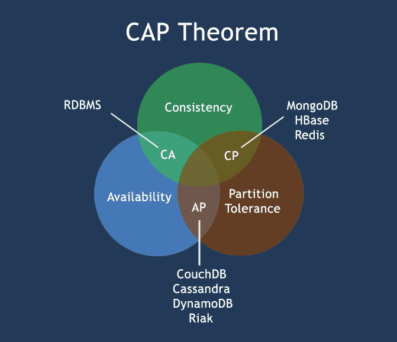

# Base 理论与 CAP 原则

## 分布式一致性（Consensus）

分布式一致性问题，可以简单的理解为在一个或多个进程提议某个值的确切之后，系统中其他所有进程对于这个值达成一致，从而在整个系统中对于这个值都是确定的。

对于这样的协定问题在分布式系统中很常见，比如我们后面讲的 Raft 算法中对于 Leader Election 的所有进程对 Leader 达成一致。对于这类问题所幸我们有一些特定的算法比如 Paxos、Raft，但是对于分布式一致性问题，我们试图去寻找一个一般化的解决方式以解决分布式系统中的分布式一致性问题。

通过一个形象的比喻来阐述分部署一致性（_注：图片来自互联网_）：

实际上，如果一个分布式系统非常稳定的话，解决分布式一致性问题相对简单的多。但是**实际上分布式系统一般都是基于消息传递的异步分布式系统，进程可能会因为各种因素产生诸如延时、被杀死、重启，在这个过程中消息可能会延迟、丢失、重复、乱序等等**。

**如何在复杂的情形下解决上述的分布式问题，这正是分布式一致性算法需要解决的问题！**

## **多副本状态机**


**多副本状态机指多台机器具有完全相同的状态，并且运行完全相同的确定性状态机**


**多副本状态机机制在分布式系统中被用于解决各种容错问题**，在分布式系统中我们经常使用多副本的方式来实现容错，每一份数据多保存多份副本，这样部分副本的失效不会导致数据的丢失。比如传统的主从数据库同步就无法同时保证数据的一致性和可用性，CAP 理论从理论上证明了这个问题。

另一方面，Paxos、Raft等分布式一致性算法则可在一致性和可用性之间取得很好的平衡，在保证一定的可用性的同时，能够对外提供强一致性，因此Paxos、Raft等分布式一致性算法被广泛的用于管理副本的一致性，提供高可用性。

多副本状态机的每个副本上都保存有完全相同的操作日志，保证所有状态机副本按照相同的顺序执行相同的操作，这样由于状态机是确定性的，则会得到相同的状态，多副本状态机结构如下（_注：图片来自互联网_）：

可以看到，在每个服务器中保存一系列命名，所有状态机副本都按照相同的顺序执行，分布式一致性算法管理着来自客户端的包含状态机命令的日志复制，每条日志以同样的顺序保存同样的命令，因此每个状态机执行同样的命令序列。**分布式一致性算法保证了复制到各个服务器的日志的一致性，这样也就保证了服务器的一致性，从而保证数据值的最终确定性是一致的。**

## CAP 概念


**CAP定理：在一个分布式系统中，CAP 原则这三个要素最多只能满足其中两个要素，无法三者均满足！**


CAP 原则也叫 CAP 定理，他描述的是在一个分布式系统中 CAP 的一个关系，所谓 CAP，即 Consistency、Availability、Partitiontolerance。

* 一致性（**Consistency**）：分布式系统中的所有数据备份在同一时刻是否都是同样的值
* 可用性（**Availability**）：在分布式系统中，集群中的部分节点故障后，真个集群是否还能正常的响应客户端的请求
* 分区容错性（**Partition Tolerance**）：在分布式系统中，如果在同一时刻无法满足数据一致性，就意味着发生了分区，这时候就必须在 C 与 A 见做出选择（_注：图片来自互联网_）

如上图所示，分布式系统只能是 AP、CP、CA 这三种情况！

## BASE 理论

BASE 理论是 **Basically Available**（基本可用）、**Soft state**（软状态）和 **Eventually consistent**（最终一致性）三个短语的简写。

Base 理论是对 CAP 中的一致性和可用性权衡的结果，简单的说：即使分布式系统无法做到强一致性，那么也应该根据自身系统特点从而使系统达到最终一致性。

* 基本可用：指允许系统在出现不可预知的故障错误时，允许损失部分可用性
* 软状态：指系统中的数据允许存在中间状态，这种状态的数据存在不会影响系统的整体可用性；换句话说允许系统在不同节点的数据副本之间进行数据同步的过程时允许存在延时
* 最终一致性：数据必须要有一个最终状态，不要求要时序性上保障数据的强一致性

## Reference

* [百度百科 CAP](https://baike.baidu.com/item/CAP%E5%8E%9F%E5%88%99/5712863?fr=aladdin)

