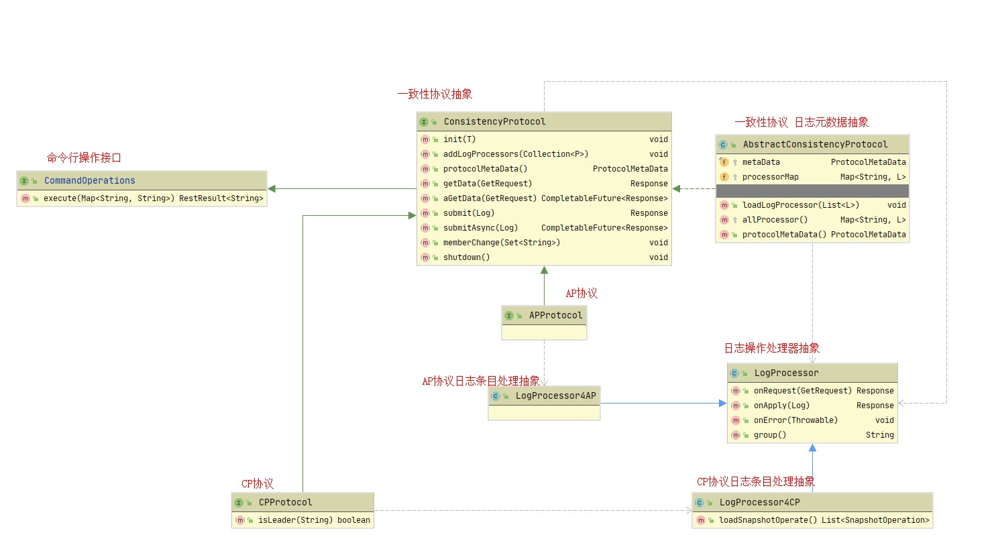

# Nacos 中的一致性协议（一）

## 写在前面


Nacos 在 1.3.0 重新构建了内核，修改内容比较大，这里我们主要关注以下几点

1. **nacos内部事件机制**
2. **nacos一致性协议层**
3. **对于AP协议以及CP协议的统一抽象**


前面讲了很多内容实际上都是为了接下来介绍 Nacos 中的一致性协议做准备，简单回顾一下：

* **CAP、一致性协议理论**
* **Protobuf**
* **Hessian**
* **Raft 算法**
* **JRaft 算法：**建议反复阅读蚂蚁金服的 SOFAJRaft 指南，因为 Nacos 就是在它的基础上去实现的

如果不了解前面讲的这些直接去理解 Nacos 的一致性协议抽象的话是非常困难的，尤其是你对 Raft 算法没有概念的情况下。

这一部分内容会拆分为几章来讲，尽可能以小而清晰的篇幅来讲解，因为这一块儿内容可以说是 Nacos 的基石，需要大家花费大量的时间、精力去消化、吸收。

_**注意：由于一致性协议涉及到 core 模块，所以这部分内容会提前讲到 core 模块的源码内容**_

## Nacos 一致性协议抽象

在前面的**`基本概念与架构`**一章我们可以从**`逻辑架构`**这一节中看出**一致性协议层**在 Nacos 中是最为核心的一层，它定义了 Nacos 整体的一致性协议抽象，由于在一致性协议因为我们必须考虑分区容错性，所以就分为了两大类：

* 最终一致性
* 强一致性

比如，在 naming 模块中，需要用到 AP、CP，而在 confg 模块则需要用到 CP。基于并结合之前 Nacos 的一些历史包袱最终 Nacos 团队采取了使用 JRaft 来作为一致性协议的选型，当然不排除后期可能会自己实现。基于此，Nacos 在 `1.3.0` 全新的内核构建中有了下面的最新一致性协议设计，UML 图如下（下图省略了 `Config` 接口，后面会说明）：



先总体描述一下上图一致性协议抽象的 UML 图，方便大家先对 Nacos 一致性协议的抽象有个总体概念，然后我们在逐一分析每个接口、类的作用。

### 总体描述


针对 Nacos 中一致性协议抽象的整体描述，可参考上面的 UML 图


1. Nacos 中的一致性协议首先定义了一个 `ConsistencyProtocol` 接口作为 Nacos 整体对于一致性协议的抽象，其他任何一致性协议实现都是基于此抽象完成的，这个抽象内部关联了 `Config 接口`、`LogProcessor 抽象类`，同时 `ConsistencyProtocol` 还继承了 `CommandOperations` 接口
2. `CommandOperations` 接口只定义了一个 `execute()` 方法，实际上这个接口就是作为 `JRaft` 通过 `CliService` 实现对 `raft group` 的服务管理的操作
3. 额外说明：`AbstractConsistencyProtocol` 是处于 `core 模块`下的抽象类，它实现了 `ConsistencyProtocol` 接口并在内部维护了 `ProtocolMetaData` 元数据信息以及 key 为 group 标记，value 为 LogProcessor 实现的 Map；这个抽象类是为具体实现一致性协议提供的基类
4. 一致性协议说到底还是针对数据的，因此 Nacos 封装了数据查询、修改两大类操作，分别对应通过 Protobuf 生成的 Log、GetRequest 对象；不同的模块通过一致性协议提交数据后需要由不同的模块分别去做处理，因此需要抽象一个 Processor 用来处理来自不同功能模块的数据请求。因此 Nacos 抽象了一个 LogProcessor 类来定义这些抽象处理（Processor 需要提供提交日志方法、获取日志方法、错误处理、还需要提供针对不同处理器的标识信息方法）
5. 在 `ConsistencyProtocol` 下目前有 `APProtocol`、`CPProtocol` 两个接口分别对应 AP、CP 的一致性协议抽象，这两个抽象分别对应 `LogProcessor4AP`、`LogProcessor4CP` 这两个抽象类；LogProcessor4CP 抽象类的实现为 `DistributedDatabaseOperateImpl` 
6. 针对 AP 场景，`LogProcessor4AP` 不需要在扩展额外的方法；针对 CP 场景由于存在快照的概念，因此 `LogProcessor4CP` 需要扩展一个 `loadSnapshotOperate()` 方法；这个方法由 LogProcessor 自行决定选用哪个 SnapshotOperate 进行保存、加载操作

### ConsistencyProtocol 接口

ConsistencyProtocol 是 Nacos 一致性协议的抽象，如下：

```java
public interface ConsistencyProtocol<T extends Config, P extends LogProcessor> extends CommandOperations {

    /**
     * 一致性协议初始化，根据 Config 实现类；目前只有 JRaft 一致性协议的初始化
     */
    void init(T config);

    /**
     * 增加一个日志处理器
     */
    void addLogProcessors(Collection<P> processors);

    /**
     * 一致性协议的元数据信息
     */
    ProtocolMetaData protocolMetaData();

    /**
     * 同步获取数据
     */
    Response getData(GetRequest request) throws Exception;

    /**
     * 异步获取数据
     */
    CompletableFuture<Response> aGetData(GetRequest request);

    /**
     * 同步数据提交，在 Datum 中已携带相应的数据操作信息
     */
    Response submit(Log data) throws Exception;

    /**
     * 异步数据提交，在 Datum 中已携带相应的数据操作信息，返回一个Future，自行操作，提交发生的异常会在CompleteFuture中
     */
    CompletableFuture<Response> submitAsync(Log data);

    /**
     * 新的成员节点列表，一致性协议自行处理相应的成员节点是加入还是离开
     */
    void memberChange(Set<String> addresses);

    /**
     * 一致性协议服务关闭
     */
    void shutdown();

}
```


