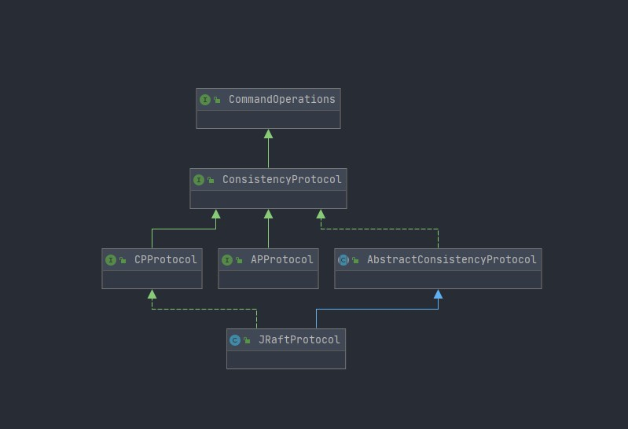

# 一致性协议抽象层

## 写在前面


Nacos 在 1.3.0 重新构建了内核，修改内容比较大，这里我们主要关注以下几点

1. **nacos 内部事件机制**
2. **nacos 一致性协议层**
3. **对于 AP 协议以及 CP 协议的统一抽象**

注意：由于一致性协议涉及到 core 模块，所以这部分内容会提前讲到 core 模块的源码内容


前面讲了很多内容实际上都是为了接下来介绍 Nacos 中的一致性协议做准备，简单回顾一下前面几个小节补充的一些理论知识，如果不了解前面讲的这些直接去理解 Nacos 的一致性协议抽象的话是非常困难的，尤其是你对 Raft 算法没有概念的情况下。这一部分内容会拆分为几章来讲，尽可能以小而清晰的篇幅来讲解，因为这一块儿内容可以说是 Nacos 的基石，需要大家花费大量的时间、精力去消化、吸收。

## Nacos 一致性协议层

在前面的**`基本概念与架构`**一章我们可以从**`逻辑架构`**这一节中看出**一致性协议层**在 Nacos 中是最为核心的一层，它定义了 Nacos 整体的一致性协议抽象，由于在一致性协议因为我们必须考虑分区容错性，所以就分为了两大类：

* **最终一致性**
* **强一致性**

比如，在 naming 模块中，需要用到 AP、CP，而在 confg 模块则需要用到 CP。

基于并结合之前 Nacos 的一些历史包袱最终 Nacos 团队采取了使用 JRaft 来作为一致性协议的选型，当然不排除 Nacos 团队后期可能会自己实现一致性协议。

基于此，Nacos 在 `1.3.0` 全新的内核构建中有了下面的最新一致性协议设计，UML 图如下（省略了 `Config` 接口）：


接下来我们先总体描述一下上图一致性协议抽象的 UML 图中涉及的接口、抽象类，方便大家先对 Nacos 一致性协议的抽象有个总体概念，然后我们在逐一分析每个接口、类的作用。

## 总体描述


针对 Nacos 中一致性协议抽象的整体描述，可参考上面的 UML 图


1. Nacos 中的一致性协议首先定义了一个 `ConsistencyProtocol` 接口作为 Nacos 整体对于一致性协议的抽象，其他任何一致性协议实现都是基于此抽象完成的，这个抽象内部关联了 `Config 接口`、`LogProcessor 抽象类`，同时 `ConsistencyProtocol` 还继承了 `CommandOperations` 接口
2. `CommandOperations` 接口只定义了一个 `execute()` 方法，实际上这个接口就是作为 `JRaft` 通过 `CliService` 实现对 `raft group` 的服务管理的操作
3. 额外说明：`AbstractConsistencyProtocol` 是处于 `core 模块`下的抽象类，它实现了 `ConsistencyProtocol` 接口并在内部维护了 `ProtocolMetaData` 元数据信息以及 key 为 group 标记，value 为 LogProcessor 实现的 Map；这个抽象类是为具体实现一致性协议提供的基类
4. 一致性协议说到底还是针对数据的，因此 Nacos 封装了数据查询、修改两大类操作，分别对应通过 Protobuf 生成的 GetRequest、Log 对象；不同的模块通过一致性协议提交数据后需要由不同的模块分别去做处理，因此需要抽象一个 Processor 用来处理来自不同功能模块的数据请求。Nacos 抽象了一个 LogProcessor 类来定义这些抽象处理（Processor 需要提供提交日志方法、获取日志方法、错误处理、还需要提供针对不同处理器的标识信息方法）
5. 在 `ConsistencyProtocol` 下目前有 `APProtocol`、`CPProtocol` 两个接口分别对应 AP、CP 的一致性协议抽象，这两个抽象分别对应 `LogProcessor4AP`、`LogProcessor4CP` 这两个抽象类；LogProcessor4CP 抽象类的实现为 `DistributedDatabaseOperateImpl` 
6. 针对 AP 场景，`LogProcessor4AP` 不需要在扩展额外的方法；针对 CP 场景由于存在快照的概念，因此 `LogProcessor4CP` 需要扩展一个 `loadSnapshotOperate()` 方法；这个方法由 LogProcessor 自行决定选用哪个 SnapshotOperate 进行保存、加载操作

接下来，我们就具体看下 Nacos 一致性协议涉及的接口、类。

### 一致性协议操作接口

从目前的 Nacos 一致性协议实现上来看，只有 CP 模式实现了这个接口，我们可以看下这个接口相关的 UML 图：



CommandOperations 接口提供了一个 接收 Map 类型的 commands 的 execute\(\) 方法；这个接口抽象了一致性协议实现类去管理 raft group 服务的操作，接口定义如下：

```java
public interface CommandOperations {

    /**
     * 操作维护入口
     */
    default RestResult<String> execute(Map<String, String> commands) {
        return RestResultUtils.success();
    }
}

```

可以通过前面的 UML 看出，**JRaftProtocol** 这个类最终实现了一致性协议（CP 模式）。

总之，CommandOperations 接口是为了给底层实现一致性协议的实现类提供了用于操作、维护 raft group 的实现定义，由于_现在 Nacos 采用的是 JRaft 作为底层的一致性协议具体实现，因此这个操作维护 raft group 也是借助 JRaft 的 CliServer 实现的_（后面的章节会讲解）。

_**换句话说：Raft 协议是针对 CP 模式使用的，因此 AP 模式不关心**_

### 一致性协议接口

ConsistencyProtocol 是 Nacos 一致性协议的高层抽象，定义了以下方法：

* 一致性协议初始化
* 增加日志条目处理器
* 获取元数据信息
* 同步/异步提交数据
* 集群成员变更
* 关闭一致性协议服务

这个接口内部可接收上界为 Config 的配置、上界为 LogProcessor 的日志处理器；此外，该接口还继承了 CommandOperations 接口提供了对于 raft froup 的服务管理，ConsistencyProtocol 的核心源码如下：

```java
public interface ConsistencyProtocol<T extends Config, P extends LogProcessor> extends CommandOperations {

    /**
     * 一致性协议初始化，根据 Config 实现类；目前只有 JRaft 一致性协议的初始化
     */
    void init(T config);

    /**
     * 增加一个日志处理器
     */
    void addLogProcessors(Collection<P> processors);

    /**
     * 一致性协议的元数据信息
     */
    ProtocolMetaData protocolMetaData();

    /**
     * 同步获取数据
     */
    Response getData(GetRequest request) throws Exception;

    /**
     * 异步获取数据
     */
    CompletableFuture<Response> aGetData(GetRequest request);

    /**
     * 同步数据提交，在 Datum 中已携带相应的数据操作信息
     */
    Response submit(Log data) throws Exception;

    /**
     * 异步数据提交，在 Datum 中已携带相应的数据操作信息，返回一个Future，自行操作，提交发生的异常会在CompleteFuture中
     */
    CompletableFuture<Response> submitAsync(Log data);

    /**
     * 新的成员节点列表，一致性协议自行处理相应的成员节点是加入还是离开
     */
    void memberChange(Set<String> addresses);

    /**
     * 一致性协议服务关闭
     */
    void shutdown();

}
```

### AP、CP协议抽象接口

这两个接口都集成自 ConsistencyProtocol，二者分别定义了 Nacos 中 CP、AP 模式下，一致性协议的定义，如下：

```java
// APProtocol
public interface APProtocol<C extends Config, P extends LogProcessor4AP> extends ConsistencyProtocol<C, P> {

}

// CPProtocol
public interface CPProtocol<C extends Config, P extends LogProcessor4CP> extends ConsistencyProtocol<C, P> {

    /**
     * 返回此节点是否为领导节点
     */
    boolean isLeader(String group);

}
```

唯一不同的点在于 CP 模式采用的是 JRaft 实现，而 Raft 一致性协议中存在 Leader、Follower 的概念，所以 CPProtocol 需要额外提供一个 `isLeader()` 的方法用来返回此节点是否为 Leader 节点。

### 协议元数据类

我们先看下这个抽象类内部的协议元数据对象 ProtocolMetaData 的结构，其内部维护了一个_**线程池大小固定为 4 的 Executor**_ 、_**一个结构为 Map&lt;String, Map&lt;Object, Object&gt;&gt; 的 metaDataMap 对象**_，源码如下：

```java
   /**
    * 线程数=4 的固定大小的线程池
    */
   private static final Executor EXECUTOR = ExecutorFactory.Managed
       .newFixedExecutorService(ProtocolMetaData.class.getCanonicalName(), 4,
           new NameThreadFactory("com.alibaba.nacos.consistency.protocol.metadata"));

   /**
    * 初始容量为 4 的元数据 Map    
    * key为groupId、value为报错了leader、term、集群信息的Map
    */
   private Map<String, MetaData> metaDataMap = new ConcurrentHashMap<>(4);
   
   
   // ...
   
   /**
    * MetaData 内部维护的是一个 Map、group
    */
   public static final class MetaData {

        /**
         * 初始容量为 8 的 ConcurrentHashMap
         */
        private final Map<String, ValueItem> itemMap = new ConcurrentHashMap<>(8);

        private final transient String group;
  
        // 省略其他方法 ...
                    
   }
```

而 MetaData 对象中维护的 itemMap 的 value 是一个 key 为字符串，value 为 ValueItem 对象的 Map，这个 ValueItem 对象结构如下：

```java
 public static final class ValueItem extends Observable {

        /**
         * 元数据 路径
         */
        private final transient String path;

        /**
         * 可重入读写锁
         */
        private final transient ReentrantReadWriteLock lock = new ReentrantReadWriteLock();

        /**
         * 读锁
         */
        private final transient ReentrantReadWriteLock.ReadLock readLock = lock.readLock();

        /**
         * 写锁
         */
        private final transient ReentrantReadWriteLock.WriteLock writeLock = lock.writeLock();

        /**
         * 元数据
         */
        private volatile Object data;

        /**
         * 阻塞队列、延迟对象
         */
        private transient BlockingQueue<Object> deferObject = new LinkedBlockingQueue<>();

    
        // 省略其他方法 ...
            
}        
```

🌠 相当于我们的 ProtocolMetaData 的 metaDataMap 本身是一个初始容量为 4 的 Map，其 value 是一个 MetaData 对象；这个 MetaData 对象内部有一个 itemMap，这个 itemMap 是一个初始容量为 8 的 Map，并且这个 Map 的 value 是一个 ValueItem 对象。

### 一致性协议抽象基类

接着我们再看下抽象一致性协议基类 AbstractConsistencyProtocol 的源代码：

```java
public abstract class AbstractConsistencyProtocol<T extends Config, L extends LogProcessor>
    implements ConsistencyProtocol<T, L> {

    /**
     * 一致性协议元数据
     */
    protected final ProtocolMetaData metaData = new ProtocolMetaData();

    /**
     * processor Map    key为group、value为group对应的日志处理器
     */
    protected Map<String, L> processorMap = Collections.synchronizedMap(new HashMap<>());

    /**
     * 装载 LogProcessor
     */
    public void loadLogProcessor(List<L> logProcessors) {
        logProcessors.forEach(logDispatcher -> processorMap.put(logDispatcher.group(), logDispatcher));
    }

    /**
     * 获取所有日志处理器
     */
    protected Map<String, L> allProcessor() {
        return processorMap;
    }

    /**
     * 获取协议元数据
     */
    @Override
    public ProtocolMetaData protocolMetaData() {
        return this.metaData;
    }

}
```

可以看见，这个类实际上是将一致性协议的元数据抽象出来作为了一致性协议的基类；不同的一致性协议可以通过继承它从而实现对协议元数据的管理、可以获取或重载日志处理器

### 日志处理器抽象

目前 Nacos 中定义了 LogProcessor 抽象类来定义不同的一致性协议实现从而扩展自己的 LogDispatcher；而 Nacos 中目前有两个日志处理器的实现：LogProcessor4AP、LogProcessor4CP 日志处理器，我们先来看下 LogProcessor 抽象类中定义的抽象方法：

```java
public abstract class LogProcessor {

    /**
     * 通过 GetRequest 获取日志消息
     */
    public abstract Response onRequest(GetRequest request);

    /**
     * 提交log
     */
    public abstract Response onApply(Log log);

    /**
     * 错误处理
     */
    public void onError(Throwable error) {
    }

    /**
     * 为了使处理事务的状态机能够将日志路由到正确的 LogProcessor，LogProcessor需要具有标识信息
     */
    public abstract String group();
```

实际上 LogProcessor 抽象类中定义的抽象方法实际上就是对于实现 Raft 一致性协议中对于日志复制的代码翻译；回顾一下这几个方法和我们前面讲到的 Raft 算法中通过日志复制，包括日志条目读取、提交、错误处理等是否有相似之处？

而 AP、CP 模式分别对应了 LogProcessor4AP、LogProcessor4CP 两个日志处理器抽象类来区分 AP、CP 模式下的日志处理器，源代码如下：

```java
// AP
public interface APProtocol<C extends Config, P extends LogProcessor4AP> extends ConsistencyProtocol<C, P> {
}

// CP
public abstract class LogProcessor4CP extends LogProcessor {
    /**
     * 发现快照处理程序
     * 由 LogProcessor 自行决定选用哪个 SnapshotOperate 进行保存、加载操作
     */
    public List<SnapshotOperation> loadSnapshotOperate() {
        return Collections.emptyList();
    }

}
```

由于 CP 模式在 Nacos 中是通过 JRaft 实现，本质上还是属于 Raft 算法的范畴，因此存在快照的概念，所以相比 AP 模式，CP 模式需要多一个加载快照处理程序的方法（如上面源码）。

目前，_Nacos 中通过 Derby 实现了快照存储的处理操作，具体实现后续会单独讲解_。

## 小结

从前面我们先初步分析了 Nacos 中一致性协议层是怎样的，其实可以得出一下基本结论：

* 通过定义一致性协议操作、一致性协议抽象、协议元数据抽象等接口定义了 Nacos 中一致性协议的基础框架
* 通过定义 AP、CP 协议接口来对应具体的一致性协议实现
* 通过定义统一的抽象日志处理器来规范实现一致性协议日志复制功能的相关操作

最后我想强调一个技巧：**我们也可以借鉴前面讲解 Raft 时将一致性协议拆解为几个子问题从而到 Nacos 的源码中去找到答案**

