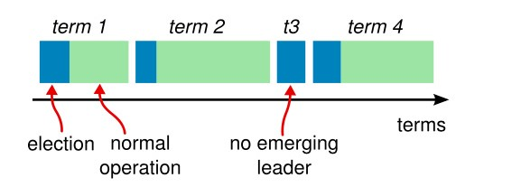
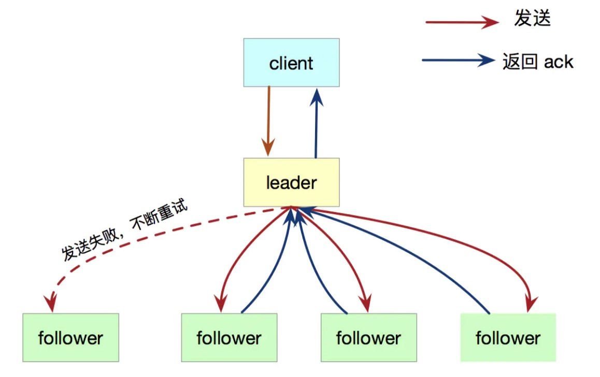

# Raft 算法

## Raft 算法概念

Raft 算法是由斯坦福大学提出的一种分布式协议，相比 Paxos 而言更加的容易理解。Raft 算法是从多副本状态机的角度出发，它用来用于管理多副本状态机的日志复制从而实现了和 Paxos 同样的功能。

之所以 Raft 算法相对 Paxos 算法更加容易理解，原因是 Raft 算法将复杂的分布式一致性问题拆解为几个子问题：

* Leader 选举（Leader election）
* 日志复制（Log replicaiton）
* 安全性（Safety）
* 日志压缩（Log compaction）
* 成员变更（Membership change）

此外，相比 Paxos 直接从一致性协议推导，**Raft 算法则使用了更强的假设来减少需要考虑的状态，从而使其变得更加容易理解和实现。**


实际上，如果你不理解 Paxos 算法也不需要气馁，因为强如斯坦福大学和加州大学伯克利分校的高年级本科生和研究生在学习 Paxos 算法时也觉得难以理解；因此，学习这类复杂的东东需要一步一个脚印，不可能一下子就吃透！


## 一致性算法特性

* 安全性保证（绝对不会返回一个错误的结果）：在非拜占庭错误情况下，包括网络延迟、分区、丢包、冗余和乱序等错误都可以保证正确。
* 可用性：集群中只要有大多数的机器可运行并且能够相互通信、和客户端通信，就可以保证可用。因此，一个典型的包含 5 个节点的集群可以容忍两个节点的失败。服务器被停止就认为是失败。他们当有稳定的存储的时候可以从状态中恢复回来并重新加入集群。
* 不依赖时序来保证一致性：物理时钟错误或者极端的消息延迟只有在最坏情况下才会导致可用性问题。
* 通常情况下，一条指令可以尽可能快的在集群中大多数节点响应一轮远程过程调用时完成。小部分比较慢的节点不会影响系统整体的性能。

## Raft 算法中的角色

Raft 算法将系统中的角色分为几个部分（_注：图片来自互联网_）：

* **Leader**：接收客户端请求并向 Follower 同步请求日志，当日志到大大多数节点后告诉 Follower 提交日志
* **Follower**：接受并持久化 Leader 同步的日志，在 Leader 告知日志可以提交后提交日志
* **Candiadte**：Leader 选举过程中的临时角色

## Raft 选举流程


任期 term


首先弄清楚在 Raft 算法中任期（term）的概念：

* 时间被划分为一个一个的任期（任期用连续的整数标记），在每一个任期开始都是一次选举，每次选举成功后在任期内会产生**最多一个 Leader** 直到任期结束；
* 如果选举失败，这个任期内就会因为没有 Leader 产生而结束；
* 此外，任期之间的切换可以在不同的时间、不同服务器上观察到。


选举 Leader


**Raft 采用了一种心跳机制来触发 Leader 选举！**

Raft 要求系统在任意时刻最多只能有一个 Leader，正常工作期间只能有 Leader、Followers 这两个角色，关于 Raft 算法系统中的角色的状态描述即流程图如下（_注：图片来自互联网_）：

* 开始，所有服务启动都是 Follower，在 Follower 超时没有收到 Leader 心跳之后，**Follower 超时**（没有收到任何来自 Leader 的心跳），**此时它会成为一个 Candidate 并开始一次 Leader 选举**
* 在 election 期间各个 Candidate 开始投票 election Leader
  * 如果在 Candidate 期间发现一个 Leader 或开启了一个新的 term，它就会从 Candidate 变为 Follower
* 此时收到大多数服务器投票的 Candidate 会成为新的 Leader
  * 如果经由投票产生的 Leader 发现在更早的 term 已经产生了一个 Leader 则此时它会转变为 Follower

> 如果你需要动态的查看选举这样的流程，可以参考文末的链接 [The Raft Consensus Algorithm](https://raft.github.io/)，它提供了一个选举的动画可以帮助你理解、消化 Raft 的选举流程（_注：图片来自互联网_）。


此外，需要特别指出的几点：


* Raft 是通过心跳（heartbeat）来触发选举流程的；Leader 周期性的向 Follower 发送心跳从而维持其 Leader 地位
* Follower 不会主动提出请求，只是响应 Leader 和 Candidate 的请求
* Leader 负责处理所有客户端请求（假如某个客户端先连接到 Follower，那么 Follower 要负责把这个客户端重定向到 Leader）

## 日志结构

日志的数据结构总总体上可以分为：**term**（任期号）、**command**（状态机需要执行的指令内容）、**index**（索引，日志条目在日志中的位置），日至结构图如下：

如上图所示，总共有 12 条日志条目，其中：

* Follower 和 Leader 的日志可能存在不同步
* **Leader 强制 Follower 复制它的日志来处理日志的不一致，Follower 上的不一致的日志会被 Leader 的日志覆盖**
  * Leader为了使Followers的日志同自己的一致，Leader需要找到Followers同它的日志一致的地方，然后覆盖Followers在该位置之后的条目）
  * Leader 会从后往前试，每次 AppednEntries 失败后尝试前一个日志条目，直到成功找到每个 Follower 的日志的一致位的 index，然后逐条覆盖 Follower 在该 index 之后的日志条目

## 日志复制

> Raft 的日志由日志有序编号（log index）组成，每个日志条目（log entries）包含了它被创建时的任期号（term）

在选举出 Leader 之后，Leader 就可以开始接收客户端的请求。Leader 把请求作为日志条目（Log entries）加入到它的日志中，然后并行的向其他服务器发起 AppendEntries RPC 复制这些日志条目。当这些日志被复制到大多数服务器上，Leader 将这条日志应用到它的状态机并向客户端返回执行结果！

\*\*\*\*🌠 **如果某些 Follower 可能没有成功的复制日志（比如 Follower 宕机了），Leader 会无限的重试直到所有 Follower 最终存储了所有日志条目**（_注：图片来自互联网_）

Raft 维护着以下日志机制从而维护一个不同服务器的日志之间的高层次的一致性：

* 如果在不同的日志中的两个条目拥有相同的索引和任期号，那么他们存储了相同的指令
* 如果在不同的日志中的两个条目拥有相同的索引和任期号，那么他们之前的所有日志条目也全部相同

## 安全性


前面讲了 Raft 算法的选举、日志复制，记得最开始我说 **Raft 算法则使用了更强的假设来减少需要考虑的状态，从而使其变得更加容易理解和实现 这一句话吗？**

我们这里就要去假设一些场景从而来补充 Raft 算法的安全性


🚩 我们假设某个 Follower 在进入不可用状态后，此时的 Leader 已经提交了很多日志条目，然后这个 Follower 在某个 term 被选举为 Leader；按照我们之前讲的，Leader 会强制覆盖 Follower 的日志条目，想想看这样不就造成不同的状态机执行不同的指令序列了吗，这显然是不合理的。

因此，在 Leader Election 这个过程需要增加一些限制来完善 Raft 算法，这一限制要保证对于任何 Leader 对于任意的 term，都要拥有之前 term 的所有被提交的日志条目。增加了这一选举时的限制，我们对于提交时的规则也更加清晰了。

具体 Raft 限制如下：

* **选举限制：**Raft 使用投票的方式来阻止一个候选人赢得选举除非这个候选人包含了所有已经提交的日志条目；RequestVote RPC 中包含了 Follower 的日志信息，然后投票人会拒绝掉那些日志条目没有自己新的投票请求
* **提交之前任期内的日志条目：**我

## 日志压缩

## 成员变更

## 浓缩总结

> Raft 一致性算法浓缩总结，不包含成员变更、日志压缩

| **特性** | **解释** |
| :--- | :--- |
| 选举安全特性 | 对于一个给定的任期号，最多只会有一个领导人被选举出来（5.2 节） |
| 领导人只附加原则 | 领导人绝对不会删除或者覆盖自己的日志，只会增加（5.3 节） |
| 日志匹配原则 | 如果两个日志在相同的索引位置的日志条目的任期号相同，那么我们就认为这个日志从头到这个索引位置之间全部完全相同（5.3 节） |
| 领导人完全特性 | 如果某个日志条目在某个任期号中已经被提交，那么这个条目必然出现在更大任期号的所有领导人中（5.4 节） |
| 状态机安全特性 | 如果一个领导人已经将给定的索引值位置的日志条目应用到状态机中，那么其他任何的服务器在这个索引位置不会应用一个不同的日志（5.4.3 节） |

## Reference

* [The Raft Consensus Algorithm](https://raft.github.io/)
* [Raft 算法中文版](https://github.com/maemual/raft-zh_cn/blob/master/raft-zh_cn.md)
* [Raft Paper](https://raft.github.io/raft.pdf)
* [Raft 算法详解](https://zhuanlan.zhihu.com/p/32052223)

