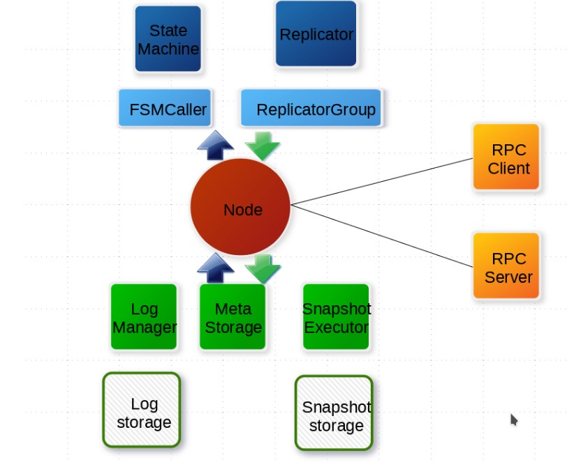

# 蚂蚁金服开源 SOFAJRaft

## 简介

SOFAJRaft 是一个基于 Raft 一致性算法的生产级高性能 Java 实现，支持 MULTI-RAFT-GROUP，适用于高负载低延迟的场景。 使用 SOFAJRaft 你可以专注于自己的业务领域，由 SOFAJRaft 负责处理所有与 Raft 相关的技术难题，并且 SOFAJRaft 非常易于使用，你可以通过几个示例在很短的时间内掌握它。


SOFAJRaft 编译要求：

* JDK 8+
* Maven 3.2.5+


## 整体功能与性能优化

我们前面介绍了 SPFAJRaft 是由百度的 braft 移植而来，那么它支持哪些功能、又做了哪些优化了，可以参考下（特性来自 [SOFAJRaft](https://github.com/sofastack/sofa-jraft) Features）：

* 领导人选举和基于优先级的半确定性领导人选举
* 日志复制和恢复
* 只读成员（学习者）
* 快照和日志压缩
* 集群成员资格管理，添加节点，删除节点，替换节点等
* 用于重新引导，负载平衡场景等的传输领导者的机制
* 对称的网络分区容限
* 不对称的网络分区容限
* 容错，少数故障不会影响系统的整体可用性
* 手动恢复群集可用于多数故障
* 线性化读取，ReadIndex / LeaseRead
* 复制管道
* 丰富的统计数据可基于[指标](https://metrics.dropwizard.io/4.0.0/getting-started.html)分析性能
* 通过[Jepsen](https://github.com/jepsen-io/jepsen)一致性验证测试
* SOFAJRaft包含嵌入式分布式KV存储实现

## 核心引擎设计



<table>
  <thead>
    <tr>
      <th style="text-align:left">&#x5F15;&#x64CE;&#x6838;&#x5FC3;&#x6982;&#x5FF5;</th>
      <th style="text-align:left">&#x4ECB;&#x7ECD;</th>
    </tr>
  </thead>
  <tbody>
    <tr>
      <td style="text-align:left">Node</td>
      <td style="text-align:left">Raft &#x5206;&#x7EC4;&#x4E2D;&#x7684;&#x4E00;&#x4E2A;&#x8282;&#x70B9;&#xFF0C;&#x8FDE;&#x63A5;&#x5C01;&#x88C5;&#x5E95;&#x5C42;&#x7684;&#x6240;&#x6709;&#x670D;&#x52A1;&#xFF0C;&#x7528;&#x6237;&#x770B;&#x5230;&#x7684;&#x4E3B;&#x8981;&#x670D;&#x52A1;&#x63A5;&#x53E3;&#xFF0C;&#x7279;&#x522B;&#x662F; <code>apply(task)</code> &#x7528;&#x4E8E;&#x5411;
        raft group &#x7EC4;&#x6210;&#x7684;&#x590D;&#x5236;&#x72B6;&#x6001;&#x673A;&#x96C6;&#x7FA4;&#x63D0;&#x4EA4;&#x65B0;&#x4EFB;&#x52A1;&#x5E94;&#x7528;&#x5230;&#x4E1A;&#x52A1;&#x72B6;&#x6001;&#x673A;&#x3002;</td>
    </tr>
    <tr>
      <td style="text-align:left">Log storage</td>
      <td style="text-align:left">LogManager &#x8D1F;&#x8D23;&#x8C03;&#x7528;&#x5E95;&#x5C42;&#x5B58;&#x50A8;&#x5B9E;&#x73B0;
        Log storage&#xFF0C;&#x5BF9;&#x8C03;&#x7528;&#x505A;&#x7F13;&#x5B58;&#x3001;&#x6279;&#x91CF;&#x63D0;&#x4EA4;&#x3001;&#x5FC5;&#x8981;&#x7684;&#x68C0;&#x67E5;&#x548C;&#x4F18;&#x5316;</td>
    </tr>
    <tr>
      <td style="text-align:left">Meta Storage</td>
      <td style="text-align:left">&#x5143;&#x4FE1;&#x606F;&#x5B58;&#x50A8;&#xFF0C;&#x8BB0;&#x5F55; raft
        &#x5B9E;&#x73B0;&#x7684;&#x5185;&#x90E8;&#x72B6;&#x6001;&#xFF0C;&#x6BD4;&#x5982;&#xFF1A;iterm&#x3001;&#x6700;&#x540E;&#x4E00;&#x6B21;&#x63D0;&#x4EA4;&#x7684;&#x65E5;&#x5FD7;&#x6761;&#x76EE;
        index&#x3001;&#x6295;&#x7968;&#x7ED9;&#x54EA;&#x4E2A;&#x8282;&#x70B9;&#x7B49;</td>
    </tr>
    <tr>
      <td style="text-align:left">Snapshot storage</td>
      <td style="text-align:left">&#x5B58;&#x653E;&#x7528;&#x6237;&#x7684;&#x72B6;&#x6001;&#x673A; snapshot
        &#x53CA;&#x5143;&#x4FE1;&#x606F;&#xFF0C;&#x53EF;&#x9009;</td>
    </tr>
    <tr>
      <td style="text-align:left">SnapshotExector</td>
      <td style="text-align:left">&#x7528;&#x4E8E; snapshot &#x5B9E;&#x9645;&#x5B58;&#x50A8;&#x3001;&#x8FDC;&#x7A0B;&#x5B89;&#x88C5;&#x3001;&#x590D;&#x5236;&#x7684;&#x7BA1;&#x7406;&#x7B49;</td>
    </tr>
    <tr>
      <td style="text-align:left">State Matchine</td>
      <td style="text-align:left">&#x7528;&#x6237;&#x6838;&#x5FC3;&#x903B;&#x8F91;&#x7684;&#x5B9E;&#x73B0;,&#x6838;&#x5FC3;&#x662F; <code>onApply(Iterator)</code> &#x65B9;&#x6CD5;&#xFF0C;&#x5E94;&#x7528;&#x901A;&#x8FC7; <code>Node#apply(task)</code> &#x63D0;&#x4EA4;&#x7684;&#x65E5;&#x5FD7;&#x5230;&#x4E1A;&#x52A1;&#x72B6;&#x6001;&#x673A;&#x3002;</td>
    </tr>
    <tr>
      <td style="text-align:left">FSMcaller</td>
      <td style="text-align:left">
        <p></p>
        <p>&#x5C01;&#x88C5;&#x5BF9;&#x4E1A;&#x52A1; StateMachine &#x7684;&#x72B6;&#x6001;&#x8F6C;&#x6362;&#x7684;&#x8C03;&#x7528;&#x4EE5;&#x53CA;&#x65E5;&#x5FD7;&#x7684;&#x5199;&#x5165;&#x7B49;&#xFF0C;&#x4E00;&#x4E2A;&#x6709;&#x9650;&#x72B6;&#x6001;&#x673A;&#x7684;&#x5B9E;&#x73B0;&#xFF0C;&#x505A;&#x5FC5;&#x8981;&#x7684;&#x68C0;&#x67E5;&#x3001;&#x8BF7;&#x6C42;&#x5408;&#x5E76;&#x63D0;&#x4EA4;&#x548C;&#x5E76;&#x53D1;&#x5904;&#x7406;&#x7B49;&#x3002;</p>
      </td>
    </tr>
    <tr>
      <td style="text-align:left">Replicator</td>
      <td style="text-align:left">Leader &#x5411; Follower &#x590D;&#x5236;&#x65E5;&#x5FD7;&#xFF0C;&#x4E5F;&#x5C31;&#x662F;
        raft &#x4E2D;&#x7684; AppendEntries &#x8C03;&#x7528;&#xFF0C;&#x5305;&#x62EC;&#x5FC3;&#x8DF3;&#x5B58;&#x6D3B;&#x68C0;&#x67E5;&#x7B49;</td>
    </tr>
    <tr>
      <td style="text-align:left">ReplicattorGroup</td>
      <td style="text-align:left">&#x5355;&#x4E2A; RAFT Group &#x7BA1;&#x7406;&#x6240;&#x6709;&#x7684; replicator&#xFF0C;&#x5FC5;&#x8981;&#x7684;&#x6743;&#x9650;&#x68C0;&#x67E5;&#x548C;&#x6D3E;&#x53D1;</td>
    </tr>
    <tr>
      <td style="text-align:left">RPC</td>
      <td style="text-align:left">RPC &#x6A21;&#x5757;&#x7528;&#x4E8E;&#x8282;&#x70B9;&#x4E4B;&#x95F4;&#x7684;&#x7F51;&#x7EDC;&#x901A;&#x4FE1;</td>
    </tr>
    <tr>
      <td style="text-align:left">RPC Server</td>
      <td style="text-align:left">&#x5185;&#x7F6E;&#x4E8E; Node &#x5185;&#x7684; RPC &#x670D;&#x52A1;&#x5668;&#xFF0C;&#x63A5;&#x6536;&#x5176;&#x4ED6;&#x8282;&#x70B9;&#x6216;&#x8005;&#x5BA2;&#x6237;&#x7AEF;&#x53D1;&#x9001;&#x8FC7;&#x6765;&#x7684;&#x8BF7;&#x6C42;&#xFF0C;&#x8F6C;&#x4EA4;&#x7ED9;&#x5BF9;&#x5E94;&#x7684;&#x670D;&#x52A1;&#x5668;&#x5904;&#x7406;&#x8BF7;&#x6C42;</td>
    </tr>
    <tr>
      <td style="text-align:left">RPC Client</td>
      <td style="text-align:left">&#x5411;&#x5176;&#x4ED6;&#x8282;&#x70B9;&#x53D1;&#x8D77;&#x8BF7;&#x6C42;&#xFF0C;&#x4F8B;&#x5982;&#x6295;&#x7968;&#x3001;&#x590D;&#x5236;&#x65E5;&#x5FD7;&#x3001;&#x5FC3;&#x8DF3;&#x7B49;</td>
    </tr>
  </tbody>
</table>

## SOFAJRaft 用户指南

### 基本概念


实际上这里的概念前面我们讲 Raft 算法的时候就已经讲了有关 log index、term 的概念了，这里再次结合 SOFAJRaft 强调一下


* **log index**：每一条提交到 raft group 的任务都被序列化为一条日志存储下来，每个日志都有一个编号，在整个 raft group 内单调递增并复制到每个 raft 节点
* **term**：我们知道在 election leader 期间就是一个 term，而这个 term 就是在整个 raft group 中单调递增的一个 long 数字，在这个 leader 没有发生变更之前，提交的所有日志都将拥有相同的 term 编号

> 如果还不清楚可以回过头看下前面的 Raft 算法



* **Endpoint**：一个服务地址（包括 IP、Port）；raft 不允许启动在 0.0.0.0 所有的 IPv4 上，需要明确指定启动的 IP 创建一个地址，如下：
  * ```text
    Endpoint addr = new Endpoint("localhost", 8080);
    String s = addr.toString(); // 结果为 localhost:8080
    boolean success = addr.parse(s);  // 可以从字符串解析出地址，结果为 true
    ```
* **PeerId**：表示一个 raft 参与节点（比如 Leader、Follower、Candidate 等），它有三要素组成，格式为：`ip:port:index` ，index 目前没有用到，表示为同一端口的序列号，预留字段。 如下：
  * ```text
    PeerId peer = new PeerId("localhost", 8080);
    EndPoint addr = peer.getEndpoint(); // 获取节点地址
    int index = peer.getIdx(); // 获取节点序号，目前一直为 0

    String s = peer.toString(); // 结果为 localhost:8080
    boolean success = peer.parse(s);  // 可以从字符串解析出 PeerId，结果为 true
    ```
* **Configuration**：表示一个 raft group 配置，也就是节点列表，如下：
  * ```text
    PeerId peer1 = ...
    PeerId peer2 = ...
    PeerId peer3 = ...
    // 由 3 个节点组成的 raft group
    Configuration conf = new Configuration();
    conf.addPeer(peer1);
    conf.addPeer(peer2);
    conf.addPeer(peer3);
    ```

### 工具类 JRaftUtils

这个工具类是为了方便创建 Endpoint/PeerId/Configuration 等对象， jraft 提供了 JRaftUtils 来快捷地从字符串创建出所需要的对象：

```java
Endpoint addr = JRaftUtils.getEndpoint("localhost:8080");
PeerId peer = JRaftUtils.getPeerId("localhost:8080");
// 三个节点组成的 raft group 配置，注意节点之间用逗号隔开
Configuration conf = JRaftUtils.getConfiguration("localhost:8081,localhost:8082,localhost:8083");
```

###  回调 Closure 和状态 Status

Closure，也叫闭包，在 JRaft 中我们实际上可以看成一个简单的 callback 接口，JRaft 中提供的大量方法都是基于异步的回调模式，结果通过此接口实现：

```java
package com.alipay.sofa.jraft;

/**
 * Callback closure.
 *
 * @author boyan (boyan@alibaba-inc.com)
 *
 * 2018-Apr-03 11:07:05 AM
 */
public interface Closure {

    /**
     * Called when task is done.
     *
     * @param status the task status.
     */
    void run(final Status status);
}
```

回调结果通过 Status 获取， `Status#isOk()` 告诉你成功还是失败，错误码和错误信息可以通过另外两个方法获取：

```java
boolean success= status.isOk();
RaftError error = status.getRaftError(); // 错误码，RaftError 是一个枚举类
String errMsg = status.getErrorMsg(); // 获取错误详情
```

另外，Status 也提供了一些简单的方法来创建，如下：

```java
// 创建一个成功的状态
Status ok = Status.OK();
// 创建一个失败的错误，错误信息支持字符串模板
String filePath = "/tmp/test";
Status status = new Status(RaftError.EIO, "Fail to read file from %s", filePath);
```

###  任务 Task


## Reference

* [SOFAJRaft](https://github.com/sofastack/sofa-jraft)
* [SOFAJRaft 指南](https://www.sofastack.tech/projects/sofa-jraft/overview/)


