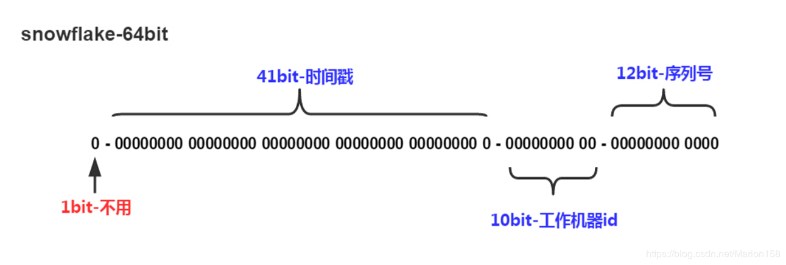
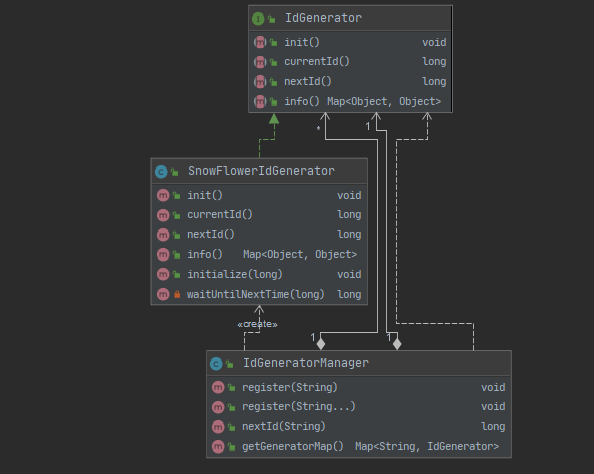
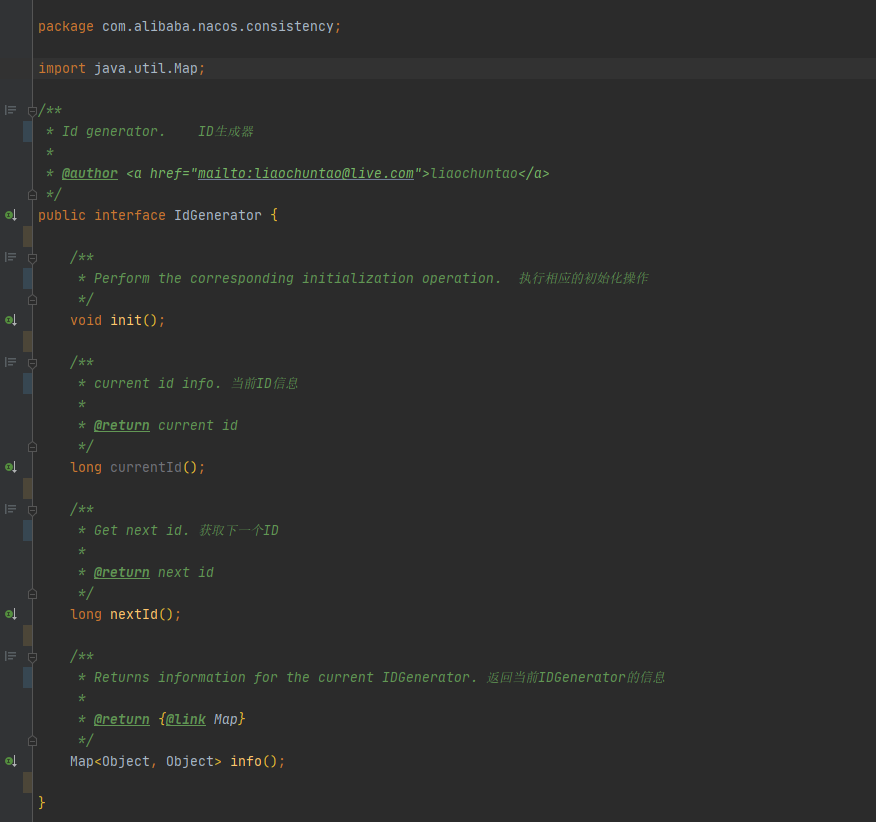

# **简介**

> 特别说明：本文剖析源码项目地址：[https://github.com/rexlin600/nacos](https://github.com/rexlin600/nacos)，注意使用 `feature-1.3.1` 分支

本文主要讨论的是目前 `Nacos` 中的雪花 `ID` 生成算法（`snwoflake` 算法），该算法最初是由 `Twitter` 开源的一种 `ID` 生成算法，其生成的 `ID` 结构如下：



即生成的 `ID` 分为四个部分，如下：

*  1bit，符号位，固定使用0，表示生成的id为正整数
*  41bit，用来记录时间戳，(241\- 1) / (1000*60*60*24*365) = 69年
*  10bit，工作机器ID，分成5bit的datacenterId和5bit的workerId，可以部署在210\= 1024个节点
*  12bit，最后12位位序列号，用来记录同毫秒产生的不同id。212\- 1 = 4095，可以使用0～4095，共4096个id序号

当然雪花算法也有两个典型的问题，就是：

- `时钟回拨问题`：最常见的问题就是时钟回拨导致的ID重复问题，时钟回拨涉及两种情况
    - 实例停机→时钟回拨→实例重启→计算ID
    - 实例运行中→时钟回拨→计算ID
- `手动配置问题`：另一个就是 workerId（机器ID）是需要部署时手动配置，手动管理的内容就有出错的可能

**补充：**

有些公司是将 `workerId` 拆分为 `workerId`、`dataId`，各占 `5bit`，当然同样也存在上面的两个问题。

</br>

## **UML图**

在 `consistency` 模块中定义了一个 `IdGenerator` 接口，其实现与管理器在 `core` 目录下，但是既然在 `consistency` 模块看到了这个接口，那么我们还是来聊一下这个 `ID 生成器` ，它的 `UML` 图如下：



</br>

- `SnowFlowerIdGenerator` 实现了 `IdGenerator` 接口
- `IdGeneratorManager` 由 `IdGenerator` 组合并负责创建 `SnowFlowerIdGenerator` 实现类

可以从上图很清晰的看到在 `consistency` 块中定义了一 `ID 生成器接口` 并且通过 `SnowFlowerIdGenerator` 实现了这个接口，然后使用 `IdGeneratorManager` 来统一管理。

</br>

## **Nacos中的雪花算法**

这一小节，我们来分析一下在 `nacos` 中，雪花算法是如何实现的（重点关注于它是如何解决上面说的那两个问题的）

</br>

### **IdGenerator接口**

我们首先来看下 `IdGenerator` 的定义：



</br>

接口相对比较简单，非常常规的 `IdGenerator` 的定义（从这个设计上也可以看出以后 `Nacos` 可能可能会采用其他的 `ID 生成器` 的实现），核心还是在其实现类 `SnowFlowerIdGenerator` 上

</br>

### **SnowFlowerIdGenerator实现类**

> 先来看下 IdGenerator 接口的实现类的实现：

```java
public class SnowFlowerIdGenerator implements IdGenerator {

    /**
     * Start time intercept (2018-08-05 08:34)
     * 启始时间，即生成雪花算法ID的起始时间以这个值为基准
     */
    public static final long EPOCH = 1533429240000L;

    private static final Logger logger = LoggerFactory.getLogger(SnowFlowerIdGenerator.class);

    // 序列所占位数
    private static final long SEQUENCE_BITS = 12L;

    // workerId所占位数
    private static final long WORKER_ID_BITS = 10L;

    // 序列掩码（111111111111B = 4095）
    private static final long SEQUENCE_MASK = 4095L;

    // workerId左边共12位（序列号）
    private static final long WORKER_ID_LEFT_SHIFT_BITS = 12L;

    // 时间戳左边共22位（序列号+workerId）
    private static final long TIMESTAMP_LEFT_SHIFT_BITS = 22L;

    // 工作机器ID最大值1024
    private static final long WORKER_ID_MAX_VALUE = 1024L;

    // 工作ID
    private long workerId;

    // 序列号
    private long sequence;

    // 上次ID生成时间
    private long lastTime;

    // 当前ID
    private long currentId;

    // 类初始化，在每次新建一个雪花算法ID实例时都会初始化一次
    {
        // 默认workerId = -1（配置workdId在 console 模块的 properties 配置文件中）
        long workerId = ApplicationUtils.getProperty("nacos.core.snowflake.worker-id", Integer.class, -1);

        if (workerId != -1) {
            // 如果指定了 workId 则使用指定的 workId
            this.workerId = workerId;
        } else {
            // 如果没有指定 workerId 则通过计算InetAddress哈希码来计算出 workerId
            InetAddress address;
            try {
                address = InetAddress.getLocalHost();
            } catch (final UnknownHostException e) {
                throw new IllegalStateException("Cannot get LocalHost InetAddress, please check your network!");
            }
            byte[] ipAddressByteArray = address.getAddress();
            this.workerId = (((ipAddressByteArray[ipAddressByteArray.length - 2] & 0B11) << Byte.SIZE) + (
                ipAddressByteArray[ipAddressByteArray.length - 1] & 0xFF));
        }
    }

    @Override
    public void init() {
        initialize(workerId);
    }

    @Override
    public long currentId() {
        return currentId;
    }

    @Override
    public synchronized long nextId() {
        long currentMillis = System.currentTimeMillis();

        // 防止时钟回拨：检查是否发生时钟回拨
        Preconditions.checkState(this.lastTime <= currentMillis,
            "Clock is moving backwards, last time is %d milliseconds, current time is %d milliseconds",
            new Object[]{this.lastTime, currentMillis});

        // 如果在同一个毫秒序列则阻塞到下一个毫秒，直到获得新的时间戳
        if (this.lastTime == currentMillis) {
            if (0L == (this.sequence = ++this.sequence & 4095L)) {
                currentMillis = this.waitUntilNextTime(currentMillis);
            }
        } else {
            this.sequence = 0L;
        }

        this.lastTime = currentMillis;
        logger.debug("{}-{}-{}", (new SimpleDateFormat("yyyy-MM-dd HH:mm:ss.SSS")).format(new Date(this.lastTime)),
            workerId, this.sequence);

        // 返回当前毫秒序列内的 ID
        currentId = currentMillis - EPOCH << 22 | workerId << 12 | this.sequence;
        return currentId;
    }

    @Override
    public Map<Object, Object> info() {
        Map<Object, Object> info = new HashMap<>(4);
        info.put("currentId", currentId);
        info.put("workerId", workerId);
        return info;
    }

    // ==============================Constructors=====================================

    /**
     * init 初始化workId
     *
     * @param workerId worker id (0~1024)
     */
    public void initialize(long workerId) {
        if (workerId > WORKER_ID_MAX_VALUE || workerId < 0) {
            throw new IllegalArgumentException(
                String.format("worker Id can't be greater than %d or less than 0, current workId %d",
                    WORKER_ID_MAX_VALUE, workerId));
        }
        this.workerId = workerId;
    }

    /**
     * Block to the next millisecond until a new timestamp is obtained
     * 阻塞到下一个毫秒，直到获得新的时间戳
     *
     * @param lastTimestamp The time intercept of the last ID generated
     * @return Current timestamp
     */
    private long waitUntilNextTime(long lastTimestamp) {
        long time;
        time = System.currentTimeMillis();
        while (time <= lastTimestamp) {
            ;
            time = System.currentTimeMillis();
        }

        return time;
    }

}
```

</br>

__可以看出，`Nacos` 采用了 `10bit workerId` 的方式__，那么我们接下来就看下它是如何处理下面几个问题的，搞懂下面 `四个问题` 基本上也就搞懂雪花算法的生成了

</br>

#### **问题一：IdGenerator初始化过程是怎样的?**

> 在 `Nacos` 中初始化 `workerId` 如下：

* 首先 `EmbeddedStoragePersistServiceImpl` 初始化调用 `register` 方法向 `IdGeneratorManager` 中注册，如下：

```java
// 省略其他代码 ...

    /**
     * 初始化DataSourceService和IdGeneratorManager
     */
    @PostConstruct
    public void init() {
        dataSourceService = DynamicDataSource.getInstance().getDataSource();
        idGeneratorManager
            .register(RESOURCE_CONFIG_INFO_ID, RESOURCE_CONFIG_HISTORY_ID, RESOURCE_CONFIG_TAG_RELATION_ID,
                RESOURCE_APP_CONFIGDATA_RELATION_SUBS, RESOURCE_CONFIG_BETA_ID, RESOURCE_NAMESPACE_ID,
                RESOURCE_USER_ID, RESOURCE_ROLE_ID, RESOURCE_PERMISSIONS_ID);
    }

// 省略其他代码 ...
```

- `IdGeneratorManager` 中的函数式接口 `supplier ` 是在 `IdGeneratorManager` 加载到容器中时才会进行相应的初始化；而 `IdGenerator` 则在 `EmbeddedStoragePersistServiceImpl` 调用 `IdGeneratorManager` 的 `regist` 方法时通过函数式接口 `supplier.apply()` 完成了 `IdGenerator` 的初始化：

```java
// 省略其他代码 ...

/**
 * 注册 IdGenerator
 *
 * @param resource resource
 */
public void register(String resource) {
    generatorMap.computeIfAbsent(resource, s -> supplier.apply(resource));
}

// 省略其他代码 ...

/**
 * 构造器，初始化函数式接口
 */
public IdGeneratorManager() {
    this.supplier = s -> {
        IdGenerator generator;

        // 加载已存在的 IdGenerator
        ServiceLoader<IdGenerator> loader = ServiceLoader.load(IdGenerator.class);
        Iterator<IdGenerator> iterator = loader.iterator();

        // 如果存在 IdGenerator 则取出，否者实例化一个 SnowFlowerIdGenerator
        if (iterator.hasNext()) {
            generator = iterator.next();
        } else {
            generator = new SnowFlowerIdGenerator();
        }

        // 初始化 SnowFlowerIdGenerator 对应的 workerId
        generator.init();
        return generator;
    };
}

// 省略其他代码 ...
```

这样，所有的 `IdGenerator` 就都完成了初始化并纳入到 `IdGeneratorManager` 中管理

</br>

#### **问题二：如何防止时钟回拨？**

在每次通过同步方法 `nextId()` 生成 `ID` 时，会获取当前系统时间并检查本次时间遇上一次生成时间的值对比：

```java
// 省略其他代码 ...

    long currentMillis = System.currentTimeMillis();
    
    // 防止时钟回拨：检查是否发生时钟回拨
    Preconditions.checkState(this.lastTime <= currentMillis,
        "Clock is moving backwards, last time is %d milliseconds, current time is %d milliseconds",
        new Object[]{this.lastTime, currentMillis});
    
// 省略其他代码 ...
```

</br>

#### **问题三：如何获取下一个ID?**

具体使用体现在完成 `IdGenerator` 注册 之后，直接通过同步方法 `nextId()` 调用接口（参考 `EmbeddedStoragePersistServiceImpl` 类），如下：

```java
// 省略其他代码 ...

    long configId = idGeneratorManager.nextId(RESOURCE_CONFIG_INFO_ID);
    long hisId = idGeneratorManager.nextId(RESOURCE_CONFIG_HISTORY_ID);
    
// 省略其他代码 ...
```

</br>

#### **问题四：如何防止同一序列内生成的ID不重复?**

防止不重复除了前面的防止时钟回拨之外，还需要检查毫秒内生成的序列，如下：

```java
// 省略其他代码 ...

// 获取下一个ID
public synchronized long nextId() {
    long currentMillis = System.currentTimeMillis();

    // 防止时钟回拨：检查是否发生时钟回拨
    Preconditions.checkState(this.lastTime <= currentMillis,
        "Clock is moving backwards, last time is %d milliseconds, current time is %d milliseconds",
        new Object[]{this.lastTime, currentMillis});

    // 如果在同一个毫秒序列则阻塞到下一个毫秒，直到获得新的时间戳
    if (this.lastTime == currentMillis) {
        if (0L == (this.sequence = ++this.sequence & 4095L)) {
            currentMillis = this.waitUntilNextTime(currentMillis);
        }
    } else {
        this.sequence = 0L;
    }

    this.lastTime = currentMillis;
    logger.debug("{}-{}-{}", (new SimpleDateFormat("yyyy-MM-dd HH:mm:ss.SSS")).format(new Date(this.lastTime)),
        workerId, this.sequence);

    // 返回当前毫秒序列内的 ID
    currentId = currentMillis - EPOCH << 22 | workerId << 12 | this.sequence;
    return currentId;
}

/**
 * Block to the next millisecond until a new timestamp is obtained
 * 阻塞到下一个毫秒，直到获得新的时间戳
 *
 * @param lastTimestamp The time intercept of the last ID generated
 * @return Current timestamp
 */
private long waitUntilNextTime(long lastTimestamp) {
    long time;
    time = System.currentTimeMillis();
    while (time <= lastTimestamp) {
        ;
        time = System.currentTimeMillis();
    }

    return time;
}

// 省略其他代码 ...
```

</br></br>

### **IdGeneratorManager 精讲**

除了需要搞清楚上面四个问题之外我们还需要搞清楚 `IdGeneratorManager` 是如何工作的，因为 `SnowFlowerIdGenerator` 从本质上来讲只是一个实现类（工具类），它是由 `IdGeneratorManager` 这个类进行管理的，因此我们要清楚 `Nacos` 是如何运用雪花算法的还需要先搞清楚 `IdGeneratorManager` 的如下几个问题：

- `IdGeneratorManager`的组成、作用？是如何管理和维护 `IdGenerator` 的？
- `IdGenerator` 是何时、如何注册到 `IdGeneratorManager` 中的？
- `IdGenerator` 如何使用？

</br>

## **问题一：IdGeneratorManager剖析（组成、作用、维护管理）？**

__从命名就知道 `IdGeneratorManager` 的作用是负责管理 `IdGenerator` 的一个类__。

可以通过源码得到如下信息：

- 其内部维护了一个 `Map` 用于缓存本地 `IdGenerator` 实例
- 提供了一个 `函数式接口` 来完成 `IdGenerator` 的具体初始化实现
- 提供了 `register` 方法实现 `IdGenerator` 的注册（缓存到 `Map` 并通过函数式接口完成初始化）

通过源代码可以很清晰的看到其内部组成、提供的方法，以及 `Map` 缓存 `IdGenerator` 实例，`register` 方法提供注册等管理、维护方式，并且没有移除方法，从代码中的 `@Component` 可以看出其是一开始就装载到 `IoC` 容器去管理和维护的，源代码如下：

```java
@Component
public class IdGeneratorManager {

    /**
     * ID生成器 Map，本地缓存 IdGenerator 实例
     */
    private final Map<String, IdGenerator> generatorMap = new ConcurrentHashMap<>();

    /**
     * IdGenerator 函数式接口
     */
    private final Function<String, IdGenerator> supplier;

    /**
     * 构造器，在 EmbeddedStoragePersistServiceImpl 初始化前就会被其中的函数式接口
     */
    public IdGeneratorManager() {
        this.supplier = s -> {
            IdGenerator generator;

            // 加载已存在的 IdGenerator
            ServiceLoader<IdGenerator> loader = ServiceLoader.load(IdGenerator.class);
            Iterator<IdGenerator> iterator = loader.iterator();

            // 如果存在 IdGenerator 则取出，否者实例化一个 SnowFlowerIdGenerator
            if (iterator.hasNext()) {
                generator = iterator.next();
            } else {
                generator = new SnowFlowerIdGenerator();
            }

            // 初始化 SnowFlowerIdGenerator 对应的 workerId
            generator.init();
            return generator;
        };
    }

    /**
     * 注册ID生成器
     *
     * @param resource resource
     */
    public void register(String resource) {
        generatorMap.computeIfAbsent(resource, s -> supplier.apply(resource));
    }

    /**
     * Register resources that need to use the ID generator. 注册需要使用ID生成器的资源
     *
     * @param resources resource name list
     */
    public void register(String... resources) {
        for (String resource : resources) {
            generatorMap.computeIfAbsent(resource, s -> supplier.apply(resource));
        }
    }

    /**
     * request next id by resource name.
     *
     * @param resource resource name
     * @return id
     */
    public long nextId(String resource) {
        if (generatorMap.containsKey(resource)) {
            return generatorMap.get(resource).nextId();
        }
        throw new NoSuchElementException(
            "The resource is not registered with the distributed " + "ID resource for the time being.");
    }

    public Map<String, IdGenerator> getGeneratorMap() {
        return generatorMap;
    }
}
```

</br>

## **问题二：IdGenerator何时、何地注册？**

`EmbeddedStoragePersistServiceImpl` 这个类提供了 `register` 方法来让所有的 `IdGenerator` 在容器启动中就完成初始化并纳入它的管理（本地缓存），具体体现在这个类中的 `init()` 方法了，如下：

```java
// 注意这里的 Condition 条件
@Conditional(value = ConditionOnEmbeddedStorage.class)
@Component
public class EmbeddedStoragePersistServiceImpl implements PersistService {

// 省略其他代码 ...

    /**
     * The constructor sets the dependency injection order.
     */
    public EmbeddedStoragePersistServiceImpl(DatabaseOperate databaseOperate, IdGeneratorManager idGeneratorManager) {
        this.databaseOperate = databaseOperate;
        this.idGeneratorManager = idGeneratorManager;
        NotifyCenter.registerToSharePublisher(DerbyImportEvent.class);
    }

    /**
     * 初始化DataSourceService和IdGeneratorManager
     */
    @PostConstruct
    public void init() {
        dataSourceService = DynamicDataSource.getInstance().getDataSource();
        idGeneratorManager
            .register(RESOURCE_CONFIG_INFO_ID, RESOURCE_CONFIG_HISTORY_ID, RESOURCE_CONFIG_TAG_RELATION_ID,
                RESOURCE_APP_CONFIGDATA_RELATION_SUBS, RESOURCE_CONFIG_BETA_ID, RESOURCE_NAMESPACE_ID,
                RESOURCE_USER_ID, RESOURCE_ROLE_ID, RESOURCE_PERMISSIONS_ID);
    }

// 省略其他代码 ...
}
```

</br>

如果你想要在本地通过 `IDE` 调试看看 `EmbeddedStoragePersistServiceImpl` 类的初始化执行过程，那么就必须让  `@Conditional(value = ConditionOnEmbeddedStorage.class)` 触发。换句话说，要使得 `ConditionOnEmbeddedStorage` 这个条件类 返回 `true`</br></br>

接下来我们看看实现了 `Codition` 接口的 `ConditionOnEmbeddedStorage` 代码：

```java
// 条件注解实现类
public class ConditionOnEmbeddedStorage implements Condition {
    @Override
    public boolean matches(ConditionContext context, AnnotatedTypeMetadata metadata) {
        // 如果启用嵌入式存储则返回 true（启用条件：单机模式运行、不配置数据库信息）
        return PropertyUtil.isEmbeddedStorage();
    }
}

// 继续挖掘源码：获取是否启用嵌入式存储的标记代码，在 PropertyUtil 这个类中

    public static boolean isEmbeddedStorage() {
        // 这个 embeddedStorage 是 PropertyUtil 的一个静态成员变量
        return embeddedStorage;
    }
   
    /**
     * 这个静态成员变量的值依赖于 ApplicationUtils.getStandaloneMode()
     * Inline storage value = ${nacos.standalone}.
     */
    private static boolean embeddedStorage = ApplicationUtils.getStandaloneMode();

```

看到这里我们就知道要让这个条件注解生效从而引发 `EmbeddedStoragePersistServiceImpl` 的初始化就必启用嵌入式存储，就如上面代码中的注释描述一样：__如果启用嵌入式存储则返回 true（启用条件：单机模式运行、不配置数据库信息）__

</br>

**补充：如何使IdGenerator完成初始化注册？**

> *如何调试方法：以单机模式启动、不配置数据库，启动成功后会看到这样的日志输出：`Nacos started successfully in stand alone mode. use embedded storage`*

看到这里我们也可以思考一个问题：为什么 `Nacos` 要设计为通过嵌入式存储时采取初始化注册 `ID 生成器` 呢（提示：如果使用 `DB` 的话 `ID` 策略是怎样的），实际上还有及各类也是用了类似的注解（更多类在 `com\alibaba\nacos\config\server\service\repository\embedded` 下），大家可以作为拓展先自行去调试、研究下

</br>

**核心：isEmbeddedStorage的值是如何获取的？**

从上面的分析我们知道 `embeddedStorage` 的值是通过 `ApplicationUtils` 获取的，那么具体是怎样的呢？请继续看 `ApplicationUtils` 中获取 `embeddedStorage` 的值：

```java
// 省略其他代码 ...

    /**
     * Standalone mode or not
     */
    public static boolean getStandaloneMode() {
        if (Objects.isNull(isStandalone)) {
            // STANDALONE_MODE_PROPERTY_NAME=nacos.standalone
            isStandalone = Boolean.getBoolean(STANDALONE_MODE_PROPERTY_NAME);
        }
        return isStandalone;
    }

// 省略其他代码 ...
```

</br>

> **额外：spring.factories 机制**

可以看到这个变量 `embeddedStorage` 的值是 `ApplicationUtils` 读取系统变量 `nacos.standalone` 获取的，那么这个系统变量从哪儿来呢？这里就不得不提到大名鼎鼎的 `spring.factories` 了，实际上这个是仿照 `Java` 中的 `SPI` 机制实现的，具体参考文末的参考文章。

假设你清楚了 `spring.factories` 机制（不清楚可以参考文末连接或阅读福利章），在 `core` 模块下的 `spring.factories` 中定义了一个 `StandaloneProfileApplicationListener`，程序在启动时就会去实例化这个类，接着能够读取到所有的环境变量，自然也包括我们的 `nacos.standalone` 的值，代码如下：

```java
public class StandaloneProfileApplicationListener
        implements ApplicationListener<ApplicationEnvironmentPreparedEvent>, PriorityOrdered {

    private static final Logger LOGGER = LoggerFactory.getLogger(StandaloneProfileApplicationListener.class);

    @Override
    public void onApplicationEvent(ApplicationEnvironmentPreparedEvent event) {
        // 设置环境变量
        ConfigurableEnvironment environment = event.getEnvironment();
        ApplicationUtils.injectEnvironment(environment);

        if (environment.getProperty(STANDALONE_MODE_PROPERTY_NAME, boolean.class, false)) {
            environment.addActiveProfile(STANDALONE_SPRING_PROFILE);
        }

        if (LOGGER.isInfoEnabled()) {
            LOGGER.info("Spring Environment's active profiles : {} in standalone mode : {}",
                    Arrays.asList(environment.getActiveProfiles()), ApplicationUtils.getStandaloneMode());
        }

    }

    @Override
    public int getOrder() {
        return HIGHEST_PRECEDENCE;
    }
}
```

这样，`embeddedStorage` 的值就被读取到了（如果未读取到则默认为 `false`），自然 `ConditionOnEmbeddedStorage` 也就返回了 `true`，对应的 `EmbeddedStoragePersistServiceImpl` 就能够去完初始化，继而将所有的 `IdGenerator` 实例化并存入 `IdGeneratorManager` 中的 `generatorMap`，后续就可以下面这个方法，传入对应的 `resource` 名称即可获取一个 `ID`：

```java
    /**
     * request next id by resource name.
     *
     * @param resource resource name
     * @return id
     */
    public long nextId(String resource) {
        if (generatorMap.containsKey(resource)) {
            return generatorMap.get(resource).nextId();
        }
        throw new NoSuchElementException(
            "The resource is not registered with the distributed " + "ID resource for the time being.");
    }
```

</br>

## **问题三：IdGenerator使用方法**

> 其实前面已经讲了如何使用，这里再重新描述一下

经过前面的分析，我们知道程序最终执行到了 `EmbeddedStoragePersistServiceImpl` 的 `init()` 方法，并执行了  `IdGeneratorManager.register()` 方法，如下（单机模式下所有 `SnowFlowerIdGenerator` 对应的 `workerId` 都一致）：


后续需要使用雪花算法生成 `ID` 的地方直接调用 `nextId()` 方法，传入注册时对应的 `resource_name` 即可，如下：

```java
    // 参考 EmbeddedStoragePersistServiceImpl 类 #addConfigInfo 方法中的使用
    long configId = idGeneratorManager.nextId(RESOURCE_CONFIG_INFO_ID);
    long hisId = idGeneratorManager.nextId(RESOURCE_CONFIG_HISTORY_ID);
```

</br>

## Reference
- [shariding-JDBC-snowflake](http://www.cluozy.com/home/hexo/2018/08/11/shariding-JDBC-snowflake/)
- [spring.factories](https://www.cnblogs.com/itplay/p/9927892.html)

</br></br>

