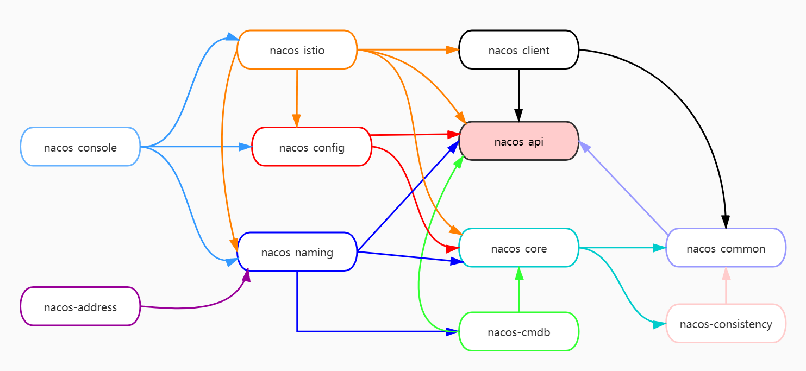
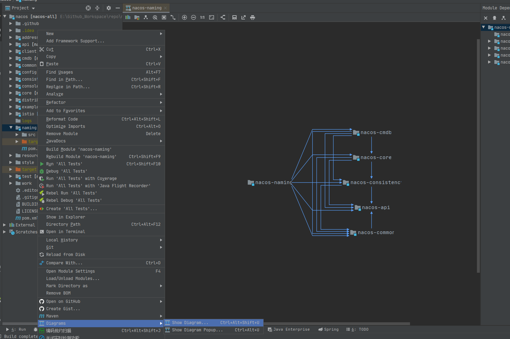

# 模块剖析

> `nacos` 版本 `1.3.1`

在阅读源码并准备调试之前，建议先 `清理一下不重要的文件和信息`（和源码无关的），笔者清理之后的结构如下：

可以看得出来，现在 `Nacos` 的代码分层、代码结构上都非常的清晰，这也是我说这个项目值得长期关注的原因，感兴趣可以去看下老版本的代码，对比一下！

## **项目模块**

> Tips：`example`、`test`、`distribution` 这里接不介绍了，前面两种分别是示例、测试模块，后者是打包后存放打包相关文件的模块

**补充说明：**`nacos-address` 依赖 `nacos-naming`，但是排除了 `nacos-naming` 中的 `nacos-cmdb` 模块

从上面的模块分析中我们可以看出模块的一些端倪：

* `被依赖最多` 的是 `nacos-api`
* `依赖其他模块最多` 的是 `nacos-istio`

除此之外，从这张图上你还能挖据出更多信息吗，欢迎一起讨论！

## **如何通过工具查看模块依赖关系**

> 这里以 naming 模块为例，实际上就是通过 IDEA 来查看

**naming 依赖的模块：**

> 可以清楚地看到 `naming` 模块依赖了其他哪些模块，这样在阅读源码的过程中就需要考虑其他模块中国提供的方法、能力对 `naming` 模块所带来的影响。（鼠标放在 `naming` 模块上然后右键 -&gt; `Diagrams` -&gt; `Show Diagrams ...` -&gt; `Project` 即可，如下面的两张图所示）

**依赖了 Naming 的模块：**

> 上面我们知道了 `naming` 依赖了哪些其他模块，那么还有哪些模块一来了 `naming` 模块呢?

**我们可以在 `IDEA` 中通过 `鼠标右键` - `Analyze` - `Module Dependencies` 然后在右侧查看这个模块被其他模块的依赖情况**（注意学习到这个小技巧帮助大家分析代码模块间的依赖关系） ，如下：

