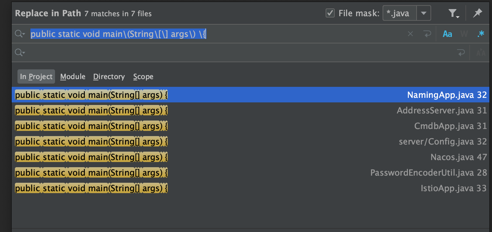
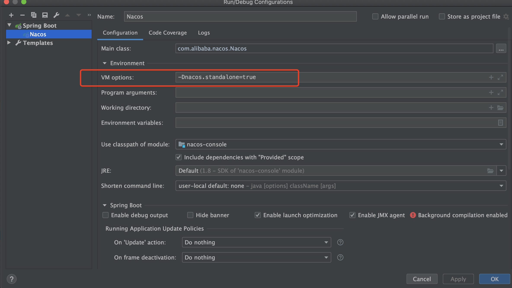
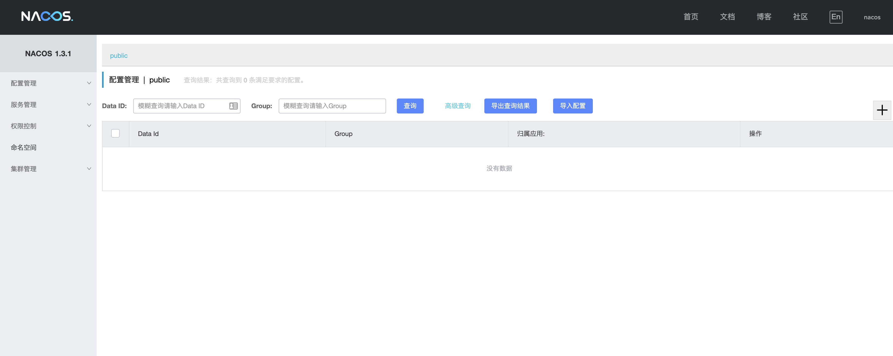

# IDE 调试

> 阅读源码，首要的是下载源码，其次就是要能够在本地调试，下面介绍如何在 IDEA 启动 nacos 的服务

前面介绍了 Nacos 有几个核心模块，我们直接在 IDEA 全局搜索启动类：



可以看到除了 `PasswordEncoderUtil` 是一个测试类之外，启动类有 6 个，但是我们应该如何去正常启动 Nacos 服务呢？

\*\*\*\*

**IDEA 中启动 Nacos**

这里直接给结论吧，只需要启动 `Nacos` 这一个应用程序即可（注意需要添加 VM options 以单机模式启动 `-Dnacos.standalone=true` ），如下：



启动完成后可以在控制台看到如下日志打印则表示启动成功，接着访问 `<your ip>:8848/nacos/index.html` 即可（默认用户名/密码为 `nacos/nacos`）：

```text
...
Nacos started successfully in stand alone mode. use external storage
...
```

**Nacos 界面：**

最终的效果如下图所示（注意：这里是同时部署了`服务发现与注册中心`、`配置中心`）：



**如何单独部署注册中心或配置中心？**

如果你需要单独部署 `服务发现与注册中心` 或 `配置中心` 则可以通过增加启动参数来达到你的需求：

* 增加启动参数  `-Dnacos.functionMode=naming` 以只启动 `服务发现与注册中心`
* 增加启动参数 `-Dnacos.functionMode=config` 以只启动 `配置中心` 

大家也可以参考源码中的 `${your workspace}/nacos/distribution/bin` 下的 `startup.sh` 中第 `84` 行开始的 `JVM Configuration` 去查看

