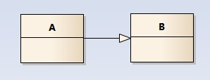
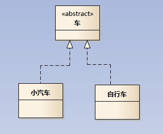
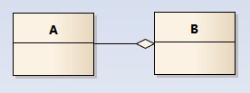
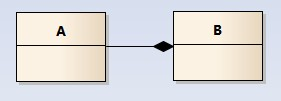
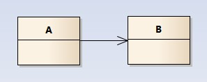
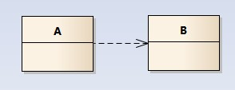

# 极简UML

## 简介

注意：本文不会将 `UML` 的各种元素都提到，本文将着重于如下几个点的介绍：

* 类图中各个类之间的关系
* 看懂类图中各个类之间的线条、箭头含义

## **类之间的关系**

只要你能看懂类图中各个类之间的线条、箭头代表什么意思后，也就足够应对日常的工作和交流。

**泛化关系（generalization）**

> 继承

泛化关系（`is-a`，表示 .. 是 .. 的关系）使用一条带空心的实线箭头表示，如下图（A 继承自 B）：

**实现关系（realize）**

> 实现

实现关系使用一条待空心的虚线箭头表示，如下图：

**聚合关系（aggregation）**

> 聚合，弱依赖

聚合关系（表示 B 由 A 组成，弱依赖）使用一条带空心的菱形箭头表示，如下图：

**组合关系（composition）**

> 组合，强依赖

组合关系（表示 B 由 A 组成，强依赖）使用一条带实心的菱形箭头表示，如下图：

**关联关系（association）**

> 关联

关联关系是用一条直线表示的，如下图：

**依赖关系（dependency）**

> 依赖

依赖关系（表示 A 依赖于 B）是用一套带箭头的虚线表示的，如下图：

