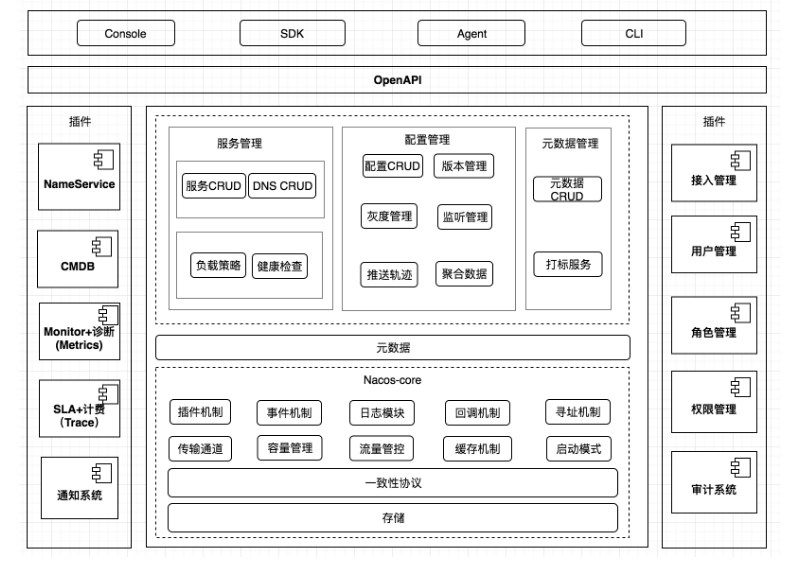

# 逻辑架构

> 阿里 Nacos 基本架构示意图（原文地址：[Nacos架构](https://nacos.io/zh-cn/docs/architecture.html)），关于基本概念这里就不再阐述了，具体请参考上一节

## **逻辑架构及其组件介绍**

> 阿里 Nacos 逻辑架构

> 其实最开始我关注 Nacos 文档还没有现在完善，目前官网文档非常完善、丰富，非常适合大家学习、挖掘其团队背后的设计思想、架构理念等；后续阅读源码的过程中不需要每个模块都精读，但是要关注一些核心模块病看懂别人的设计、实现等；此外更好的方式是学以致用，自己动手实现一个 demo 从而提高自己的能力

最为关键的是我们需要了解 `Nacos` 中具有哪些组件：

* **服务管理**：实现服务CRUD，域名CRUD，服务健康状态检查，服务权重管理等功能
* **配置管理**：实现配置管CRUD，版本管理，灰度管理，监听管理，推送轨迹，聚合数据等功能
* **元数据管理**：提供元数据CURD 和打标能力
* **插件机制**：实现三个模块可分可合能力，实现扩展点SPI机制
* **事件机制**：实现异步化事件通知，sdk数据变化异步通知等逻辑
* 日志模块：管理日志分类，日志级别，日志可移植性（尤其避免冲突），日志格式，异常码+帮助文档
* **回调机制**：sdk通知数据，通过统一的模式回调用户处理。接口和数据结构需要具备可扩展性
* **寻址模式**：解决ip，域名，nameserver、广播等多种寻址模式，需要可扩展
* **推送通道**：解决server与存储、server间、server与sdk间推送性能问题
* 容量管理：管理每个租户，分组下的容量，防止存储被写爆，影响服务可用性
* 流量管理：按照租户，分组等多个维度对请求频率，长链接个数，报文大小，请求流控进行控制
* **缓存机制**：容灾目录，本地缓存，server缓存机制。容灾目录使用需要工具
* **启动模式**：按照单机模式，配置模式，服务模式，dns模式，或者all模式，启动不同的程序+UI
* **一致性协议**：解决不同数据，不同一致性要求情况下，不同一致性机制
* **存储模块**：解决数据持久化、非持久化存储，解决数据分片问题
* **Nameserver**：解决namespace到clusterid的路由问题，解决用户环境与nacos物理环境映射问题
* **CMDB**：解决元数据存储，与三方cmdb系统对接问题，解决应用，人，资源关系
* **Metrics**：暴露标准metrics数据，方便与三方监控系统打通
* **Trace**：暴露标准trace，方便与SLA系统打通，日志白平化，推送轨迹等能力，并且可以和计量计费系统打通
* 接入管理：相当于阿里云开通服务，分配身份、容量、权限过程
* **用户管理**：解决用户管理，登录，sso等问题
* 权限管理：解决身份识别，访问控制，角色管理等问题
* 审计系统：扩展接口方便与不同公司审计系统打通
* 通知系统：核心数据变更，或者操作，方便通过SMS系统打通，通知到对应人数据变更
* **OpenAPI**：暴露标准Rest风格HTTP接口，简单易用，方便多语言集成
* **Console**：易用控制台，做服务管理、配置管理等操作
* SDK：多语言sdk
* Agent：dns-f类似模式，或者与mesh等方案集成
* CLI：命令行对产品进行轻量化管理，像git一样好用

## **其他模型**

关于 Nacos 的领域模型、服务领域模型、配置领域模型等这里就不做过多介绍了，可以参考文章开始给出的参考链接，去 Nacos 官网学习（领域模型属于 DDD 的范畴，大家也可以了解一些这方面的知识，给自己做一下知识储备，未来在应对充血开发模型时能够得心应手）

此外学习领域模型也方便大家理解 Nacos 的业务，另一方面也能看出其代码是如何组织的。

## **免费的公有云服务模式**

> 非广告，方便大家先体验 Nacos，看下是否适合自己团队

好消息是目前阿里云提供了免费的 `Nacos` 公有云模式，可以去 [Nacos ACM](https://www.aliyun.com/product/acm) 使用 `Nacos` 的免费公有云服务，但是建议用于测试环境，生产还是自己搭建或使用阿里云企业级 `Nacos` 服务

