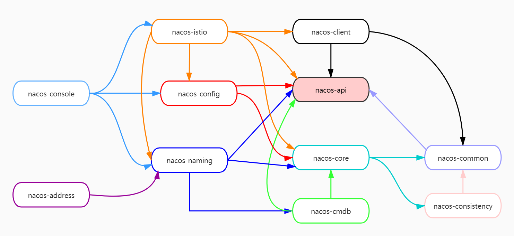
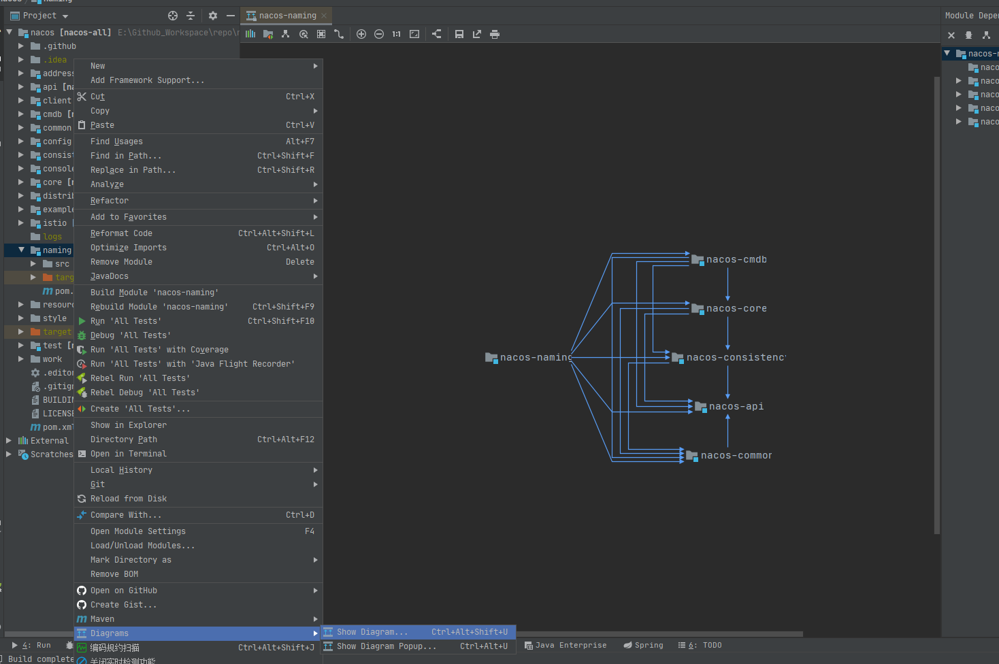
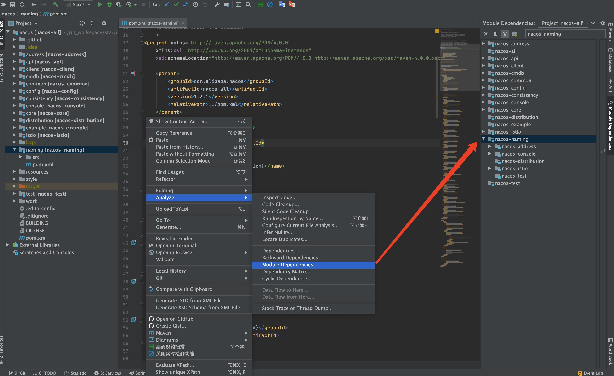

# **代码结构**

> `nacos` 版本 `1.3.1`

在阅读源码并准备调试之前，建议先 `清理一下不重要的文件和信息`（和源码无关的），笔者清理之后的结构如下：</br></br>

```bash
➜  nacos git:(feature-1.3.1) tree -L 2
.
├── BUILDING    // 构建说明    
├── LICENSE      // 许可
├── address        // address server
│   ├── pom.xml
│   └── src
├── api                // nacos api 包
│   ├── pom.xml
│   └── src
├── client            // nacos 客户端
│   ├── pom.xml
│   └── src
├── cmdb            // 解决元数据存储、与第三方cmdb系统对接问题
│   ├── pom.xml
│   └── src
├── common       // 公共包
│   ├── pom.xml
│   └── src
├── config            // nacos 配置服务
│   ├── pom.xml
│   └── src
├── consistency    // 一致性协议
│   ├── pom.xml
│   └── src
├── console        // 控制台
│   ├── pom.xml
│   └── src
├── core            // nacos 核心包
│   ├── pom.xml
│   └── src
├── distribution // 打包后的内容都在这个目录下
│   ├── LICENSE-BIN
│   ├── NOTICE-BIN
│   ├── bin
│   ├── conf
│   ├── pom.xml
│   ├── release-address.xml
│   ├── release-client.xml
│   ├── release-config.xml
│   ├── release-core.xml
│   ├── release-nacos.xml
│   └── release-naming.xml
├── example    // 示例程序
│   ├── pom.xml
│   └── src
├── istio          // 云原生集成
│   ├── pom.xml
│   └── src
├── naming    // nacos 命名服务
│   ├── pom.xml
│   └── src
├── pom.xml
├── resources
│   └── copyright
├── style        // 代码规范
│   ├── NacosCheckStyle.xml
│   ├── codeStyle.md
│   └── nacos-code-style-for-idea.xml
└── test        // 测试
    ├── pom.xml
    └── src
```

可以看得出来，现在 `Nacos` 的代码分层、代码结构上都非常的清晰，这也是我说这个项目值得长期关注的原因，感兴趣可以去看下老版本的代码，对比一下！

</br>

## **项目模块**

> Tips：`example`、`test`、`distribution` 这里接不介绍了，前面两种分别是示例、测试模块，后者是打包后存放打包相关文件的模块

</br>

**补充说明：**`nacos-address` 依赖 `nacos-naming`，但是排除了 `nacos-naming` 中的 `nacos-cmdb` 模块



</br>

从上面的模块分析中我们可以看出模块的一些端倪：

-  `被依赖最多` 的是 `nacos-api`
-  `依赖其他模块最多` 的是 `nacos-istio`

除此之外，从这张图上你还能挖据出更多信息吗，欢迎一起讨论！

</br>

## **如何通过工具查看模块依赖关系**

> 这里以 naming 模块为例，实际上就是通过 IDEA 来查看

</br>

**naming 依赖的模块：**

> 可以清楚地看到 `naming` 模块依赖了其他哪些模块，这样在阅读源码的过程中就需要考虑其他模块中国提供的方法、能力对 `naming` 模块所带来的影响。（鼠标放在 `naming` 模块上然后右键 -> `Diagrams` -> `Show Diagrams ...` -> `Project` 即可，如下面的两张图所示）



</br></br>

**依赖了 Naming 的模块：**

> 上面我们知道了 `naming` 依赖了哪些其他模块，那么还有哪些模块一来了 `naming` 模块呢?

__我们可以在 `IDEA` 中通过 `鼠标右键` - `Analyze` - `Module Dependencies` 然后在右侧查看这个模块被其他模块的依赖情况__（注意学习到这个小技巧帮助大家分析代码模块间的依赖关系） ，如下：




</br></br>
