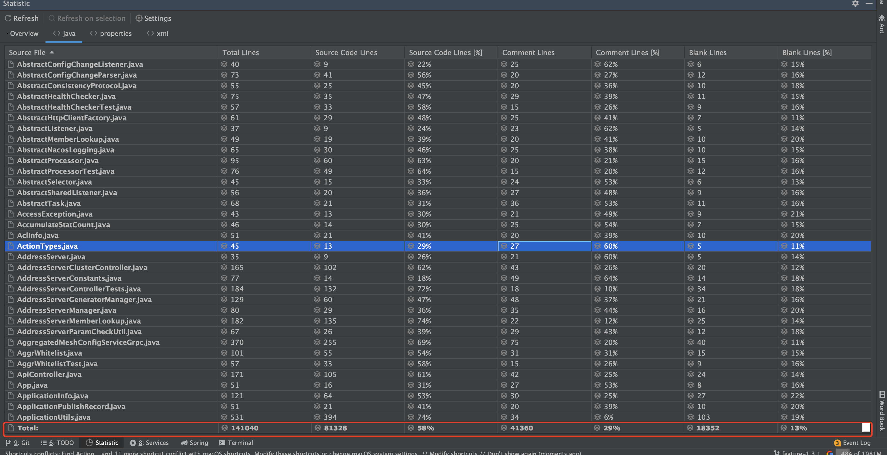
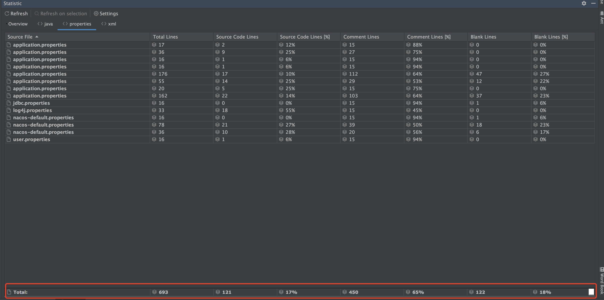

# 分析与统计

阅读源码需要讲策略，不能一股脑儿的就开始去通篇阅读，这样最后可能收效甚微。同样地，阅读源码不可能将所有实现细节都复制粘贴出来讲解

因此，我们需要先分析源码体量，然后再进一步精细化的去选择性阅读！\#\# **代码统计**

因为我们一般只关注与 Java 代码，因此我这里分析时屏蔽了 HTML、CSS、JS 等代码**总体统计：**

在阅读之前建议先分析一下代码量、占比等（可以在 IDEA 下载 statistics 插件），如下：

**Java文件统计：**

> 可以看出共计有 `14W` 行代码，有效代码占 `8W+`，占比 `58%`，代码量还是不晓得，所以不建议通篇阅读

**properties文件统计：**

> 配置相对 `Java` 源代码相对而言就少很多了

