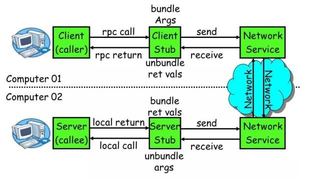
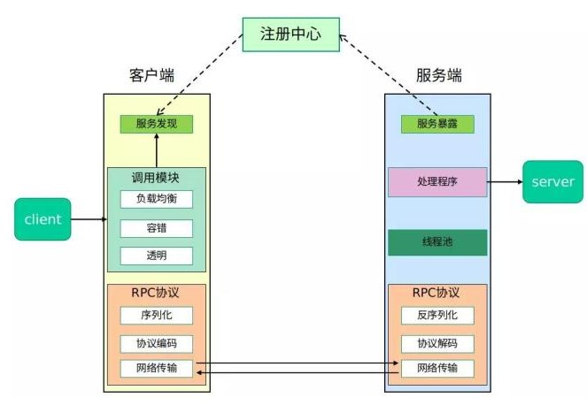
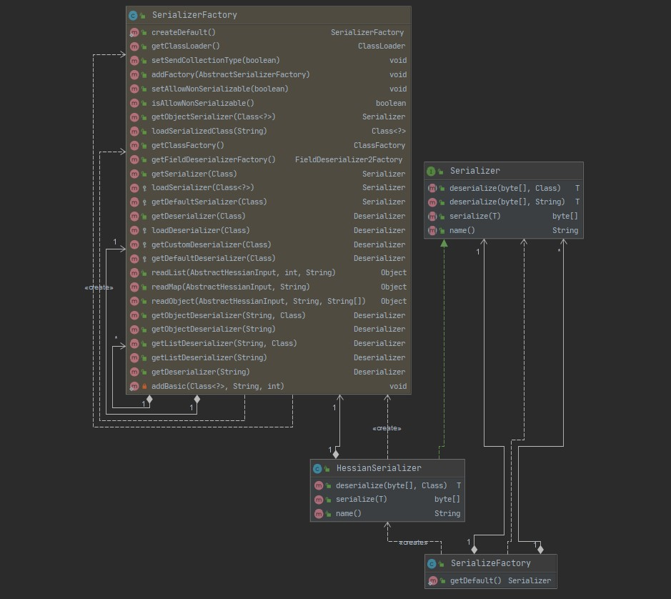

# 理解 Hessian

## Hessian 是什么

> 🚩 [百度百科](https://baike.baidu.com/item/Hessian/2385196?fr=aladdin)：Hessian 是一个轻量级的 remoting onhttp 工具，使用简单的方法提供了 RMI 的功能。 相比 WebService，Hessian 更简单、快捷。采用的是二进制 RPC 协议，因为采用的是二进制协议，所以它很适合于发送二进制数据

简单的说，Hessian 是什么，可以归纳为如下几点：

* 采用二进制远程调用协议的轻量级 RPC 框架
* 服务端、客户端都必须使用 Hessian

### 聊聊 RPC 框架

> 详细可参考文末参考文章 [什么是 RPC 框架](https://developer.51cto.com/art/201906/597963.htm)

既然我们说 Hessian 是一种轻量级 RPC 框架，那么什么又是 RPC 呢？

* **RPC 是一种技术思想而非一种规范或协议**，常见的 RPC 框架有
  * 应用级的服务框架：Dubbo、gRPC、SpringBoot/SpringCloud
  * 远程通信协议：RMI、Socket、SOAP（HTTP XML）、REST（HTTP JSON）
  * 通信框架：MINA、Netty
* **RPC 框架核心功能主要由 5 个部分组成：客户端、客户端 Sub、网络传输模块、服务端 Stub、服务端等**



* **完整的 RPC 框架包含了诸如：服务发现、负载均衡、容错、网络传输、序列化等组件，其中 RPC 协议就是指明了程序如何进行网络传输和序列化** （完整的 RPC 框架架构图如下）



* RPC 框架的核心功能就是实现上图 RPC 协议的重要部分

### 序列化和反序列化

关于 Java 的序列化我想大家网上随便找都是各种吐槽其性能低、必须实现 Serrializable 接口等等。这里总结一下 Java 序列化存在的一些我们共知的一些问题 😂 ：

1. 序列化性能低
2. 序列化后的数据偏大
3. 序列化一定要实现 Serializable 接口
4. 序列化的 serialVersionUID 如果被修改会造成序列化失效

序列化，除了上面我们提到的一些点，比如：性能、序列化后数据大小、弱依赖等，序列化和反序列化还应该具备 **跨语言**、**兼容性好**、**安全**、**性能高** 等特点。

🌠 _在 Nacos 中，使用了诸如 Protobuf、Hessian 来进行序列化与反序列化，而 Hessian 提供了一整套的 byte\[\] 的写入规范，这个规范为其他语言实现 Hessian 的 序列化和反序列化提供了可能（**目前，Nacos 只是借助 Hessian 来实现了一套序列化和反序列化**）_

🔎 为什么 Nacos 既使用 Protobuf 进行序列化与反序列化，同时还用 Hessian 进行序列化和反序列化呢？笔者没有去深入研究这个问题，不过大家可以从如下几个方向去查阅资料、思考：

* 使用场景
* 性能
* 压缩速度、大小
* 易用性
* 学习成本
* 语言、平台相关性

### Hessian 在 Nacos 中应用

下面我们看下 Nacos 是如何使用 Hessian 来实现序列化和反序列化的，在了解这之前，我们需要看下 Nacos 是如何自己封装了 Hessian 的序列化、反序列化的。

#### Nacos 借助 Hessian 实现序列化相关的 UML 图

> 如下图所示 UML 图并结合代码（此处不再贴出代码占用篇幅，感兴趣参考前面章节的 **QuickStart** 中给出的源码仓库）可以得出一些信息

* Nacos 定义了一个 **Serialzer 接口** 并由 HessianSerializer 实现了这个接口
* **HessianSerializer 实现类**中维护了一个由 Hessian 提供的 **com.caucho.hessian.io.SerializerFactory** 来管理实现序列化和反序列化
* **Nacos 自己维护了一个 SerializerFactory 来创建和管理在 Nacos 中的所有的 Serialzer 实现**



#### Hessian 序列化、反序列化在 Nacos 中的应用

在 Nacos 中存在使用 Hessian 进行序列化操作的代码如下：

```java
@Override
public <R> R queryOne(String sql, Class<R> cls) {
    try {
        LoggerUtils.printIfDebugEnabled(LogUtil.DEFAULT_LOG, "queryOne info : sql : {}", sql);

        // 序列化
        byte[] data = serializer.serialize(
            SelectRequest.builder().queryType(QueryType.QUERY_ONE_NO_MAPPER_NO_ARGS).sql(sql)
                .className(cls.getCanonicalName()).build());

        final boolean blockRead = EmbeddedStorageContextUtils
            .containsExtendInfo(Constants.EXTEND_NEED_READ_UNTIL_HAVE_DATA);

        // 异步获取数据
        Response response = innerRead(
            GetRequest.newBuilder().setGroup(group()).setData(ByteString.copyFrom(data)).build(), blockRead);
        if (response.getSuccess()) {
            // 反序列化
            return serializer.deserialize(response.getData().toByteArray(), cls);
        }
        throw new NJdbcException(response.getErrMsg(), response.getErrMsg());
    } catch (Exception e) {
        LogUtil.FATAL_LOG.error("An exception occurred during the query operation : {}", e.toString());
        throw new NacosRuntimeException(NacosException.SERVER_ERROR, e.toString());
    }
}
```

可以看到，**最终获取数据是通过一个 innerRead\(\) 的方法异步获取数据的，获取到数据之后会最终执行反序列化并返回序列化之前数据**（这里不解析 innerRead 方法，大家理解 Nacos 是如何使用 Hessian 来进行序列化、反序列化操作即可）。

### Reference

* [Hessian binary web service protocol](http://hessian.caucho.com/)
* [SpringBoot 整合 Hessian](https://www.jianshu.com/p/9136aa36cffb)
* [什么是 RPC 框架](https://developer.51cto.com/art/201906/597963.htm)

