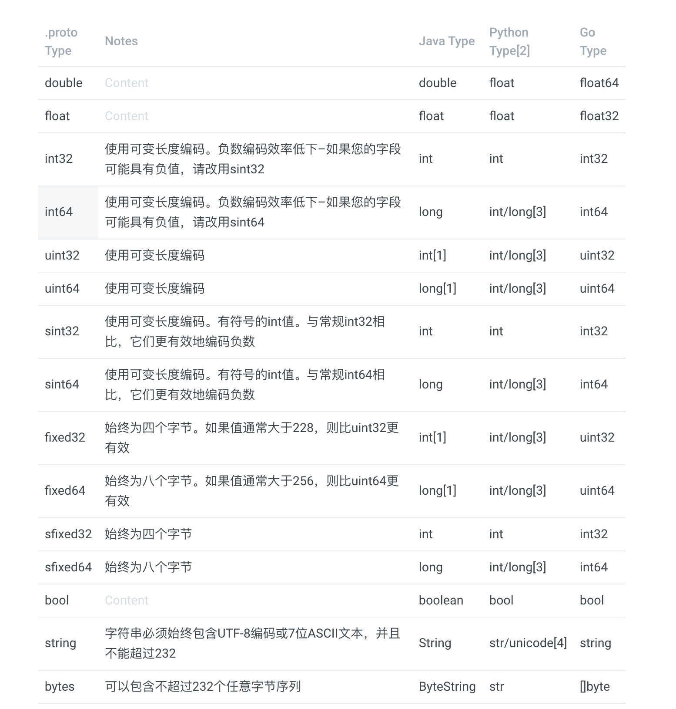

# 理解 Protobuf

## 基本概念


Protocol buffers are a language-neutral, platform-neutral extensible mechanism for serializing structured data.

翻译：Protocol buffers 是一种语言无关、平台无关的用于序列化数据的可扩展机制际


Protocol buffers，简称 Protobuf。**它是一种语言、平台无关性的序列化框架**，常用于通信协议、数据存储等领域。

另外 Protobuf 最重要的就是利用定义的 **.proto** 文件生成**特殊的源代码（特殊的源代码意思是说源代码不易读懂，Google 还是很讲究的）**，利用这个源代码我们可以非常轻松的在各种数据流中写入和读取结构化的数据。

\*\*\*\*❤ **Protobuf 优点：**

* 语言、平台无关
* 对于结构化数据优势明显；相对 JSON、XML 更小、更快，压缩数据也更小
* 扩展性、兼容性好；你可以只更新定义的 .proto 文件而不影响原有已部署的程序

💔 **Protobuf 缺点：**

* 需要定义 **.proto** 文件，根据定义的 **.proto** 文件生成相应语言的代码；只涉及序列化和反序列化技术，不涉及RPC功能（类似XML或者JSON的解析器）
* **.proto** 文件和生成的代码类相对而言难以读懂，缺乏自描述

\*\*\*\*🌠 **Protobuf 支持的语言**

目前 Protobuf 可以支持 Java, Python, Objective-C, C++ 等进行特殊源代码生成，在最新的 proto3 版本中，开始支持 Dart, Go, Ruby, C\# 等语言

### Protobuf 基本语法

> 简单介绍下 Protobuf 常用、最简单的语法情形，能够看懂 Nacos 的实例就行



> Defining A Message Type，可参考 [官方指南](https://developers.google.cn/protocol-buffers/docs/proto3#simple)

```bash
syntax = "proto3";

message SearchRequest {
  string query = 1;
  int32 page_number = 2;
  int32 result_per_page = 3;
}
```



> Protobuf 中指定的类型与对应语言生成的**数据类型参照表**（简版）





```
string：默认空字符串
bytes：默认空 byte 
bools：默认 false
numeric：默认值为 0
enums：默认值是第一个定义的枚举值，必须为0
message fileds：取决于不同的语言，详情见官方文档
```



```bash
message SearchRequest {
  string query = 1;
  int32 page_number = 2;
  int32 result_per_page = 3;
  enum Corpus {
    UNIVERSAL = 0; // 每个枚举定义都必须包含一个映射为零的常量作为其第一个元素。
    WEB = 1;
    IMAGES = 2;
    LOCAL = 3;
    NEWS = 4;
    PRODUCTS = 5;
    VIDEO = 6;
  }
  Corpus corpus = 4;
}

 enum EnumAllowingAlias {
    option allow_alias = true; // 可以通过这个选项给枚举赋相同的值，如下
    UNKNOWN = 0;
    STARTED = 1;
    RUNNING = 1;
  }
  
enum Foo {
  reserved 2, 15, 9 to 11, 40 to max;  // 避免直接移除、删除枚举值，使用 reserved 可防止未来出错
  reserved "FOO", "BAR";
}
```



```bash
// 定义生成 Java 文件的路径
option java_package = "com.example.foo";

// 诸如 messsage、enums、services 等在包路径下分别生成代码
option java_multiple_files = true;

// 要生成的 java 类文件名称
option java_outer_classname = "Ponycopter";

// 生成文件的方式；
// SPEED (default)：对消息类型进行序列化，解析和执行其他常见操作，已高度优化
// CODE_SIZE：生成最少的类，并将依赖于基于反射的共享代码来实现序列化，解析和其他各种操作
// LITE_RUNTIME：生成仅依赖于“精简版”运行时库（libprotobuf-lite而不是libprotobuf）的类
option optimize_for = CODE_SIZE;

// 字段选项 deprecated，表明字段已被弃用，在 Java 中会生成 @Deprecated 注解
int32 old_field = 6 [deprecated = true];
```



```
// 注意 protocol v2、v3 版本部分修饰已去掉，详情参考官方指南

requir​ed：必须提供该字段的值，否者消息被视为“未初始化”，将引发 IOException
optional：可选的字段
repeated：该字段可以重复任意次（包括零次），重复的字段视为动态大小的数组
```



### Nacos 实例

> 这里以 Nacos 中的 Data.proto 为例，大家能理解这个文件的写的内容即可，详细请参考 [官方指南](https://developers.google.cn/protocol-buffers/docs/proto3#simple)

```bash
// 使用 proto3 版本，默认是使用 proto2 版本协议
syntax = "proto3";

// 生成多个 Java 文件，如果生成单个文件更加的难以阅读
option java_multiple_files = true;
// 生成的文件保存的路径
option java_package = "com.alibaba.nacos.consistency.entity";

// 可以看到，消息类型是可以定义多个的

// 定义一个 Log 消息；内部字段类型、值、唯一编号定义 name value = index;
message Log {
  string group = 1;
  string key = 2;
  bytes data = 3;
  string type = 4;
  string operation = 5;
  map<string, string> extendInfo = 6;
}

// 定义一个 GetRequest 消息
message GetRequest {
  string group = 1;
  bytes data = 2;
  map<string, string> extendInfo = 3;
}

// 定义一个 Response 消息
message Response {
  bytes data = 1;
  string errMsg = 2;
  bool success = 3;
}
```

### Protobuf 之 Java Tutorial

> Java 使用 protobuf 实际上也很容易，通过下面四个步骤即可

* 项目引入 protobuf 依赖
* 定义一个 .proto 消息格式化文件，_Nacos 实例_
* 使用 protobuf 编译器编译这个文件，见上一节  _Protobuf 生成代码_
* 使用 Java Protobuf API 轻松的实现结构化消息的读取、写入


以 Nacos 为例，我们剖析一下上面那个 .proto 文件生成的代码，其中 Log 是如何使用的


**第一步：**首选在 Java 项目中引入依赖

```markup
    <dependency>
        <groupId>com.google.protobuf</groupId>
        <artifactId>protobuf-java</artifactId>
        <version>3.8.0</version>
    </dependency>
```

**第二步：**定义一个 .proto 文件

```bash
// Protocol 编译器的语法格式如下：
protoc --proto_path=_IMPORT_PATH_ \
    --cpp_out=_DST_DIR_ \
    --java_out=_DST_DIR_ \
    --python_out=_DST_DIR_ \
    --go_out=_DST_DIR_ \
    --ruby_out=_DST_DIR_ \
    --objc_out=_DST_DIR_ \
    --csharp_out=_DST_DIR_ \
    _path/to/file_.proto
    
// Java 生成代码语法一
protoc -I=$SRC_DIR --java_out=$DST_DIR $SRC_DIR/addressbook.proto

// Java 生成代码语法二
protoc --proto_path=_IMPORT_PATH_ --java_out=_DST_DIR_ _path/to/file_.proto

// 生成代码示例
protoc --proto_path=./ --java_out=./ ./Data.proto
```

**第三步：**利用 Protoco 工具生成代码

我们可以在 _consistency_ 这个模块的 _com.alibaba.nacos.consistency.entity_ 目录下可以看到 _Data.proto_ 最终生成的类：

```bash
➜  entity git:(feature-1.3.1) tree 
.
├── Data.java
├── GetRequest.java
├── GetRequestOrBuilder.java
├── Log.java
├── LogOrBuilder.java
├── Response.java
├── ResponseOrBuilder.java

0 directories, 7 files
```

我们可以通过代码清晰的看到：

* _Data.java_ 是自动生成的和 .proto 文件名一致的类，内部维护了很多 _com.google.protobuf_ 包的很多内容
* GetRequest 实现了 GetRequestBuilder（实际上面 Data.proto 文件中定义的三个 Message Type 分别都有一个 XXXBuilder 和 XXX 实现类）

**第四步：**使用 Protobuf API 进行数据的读取与写入

```java
// DistributedDatabaseOperateImpl 类通过 Protobuf API 构建一个 Log 对象

Log log = Log.newBuilder()
    // set group
    .setGroup(group())
    // set key，format：{timestamp}-{group}-{ip:port}-{signature}
    .setKey(key)
    .setData(
        // 使用 Protobuf 进行序列化数据
        ByteString.copyFrom(serializer.serialize(sqlContext))
    )
    // 存储额外数据
    .putAllExtendInfo(EmbeddedStorageContextUtils.getCurrentExtendInfo())
    // 设置 Type
    .setType(sqlContext.getClass().getCanonicalName())
    .build();
```

还我们文章最开始说的 Protobuf **它是一种语言、平台无关性的序列化框架 吗？可以从上面的构建 Log 对象的过程中可以看出来实际上我们就是通过 ByteString** 将数据进行了序列化！

后续就是通过阿里巴巴封装的 JRaft 包调用请求（这部分内容不在本文范围内），如下：

```java
    // 1. 通过 raftServer 调用 commit    
    @Override
    public CompletableFuture<Response> submitAsync(Log data) {
        return raftServer.commit(data.getGroup(), data, new CompletableFuture<>());
    }
    
    
    // 2. 具体调用如下
    public CompletableFuture<Response> commit(final String group, final Message data,
                                          final CompletableFuture<Response> future) {
        LoggerUtils.printIfDebugEnabled(Loggers.RAFT, "data requested this time : {}", data);
        final RaftGroupTuple tuple = findTupleByGroup(group);
        if (tuple == null) {
            future.completeExceptionally(new IllegalArgumentException("No corresponding Raft Group found : " + group));
            return future;
        }
    
        FailoverClosureImpl closure = new FailoverClosureImpl(future);
    
        final Node node = tuple.node;
        if (node.isLeader()) {
            // 领导节点直接应用此请求
            // The leader node directly applies this request
            applyOperation(node, data, closure);
        } else {
            // 转发给领导进行请求处理
            // Forward to Leader for request processing
            invokeToLeader(group, data, rpcRequestTimeoutMs, closure);
        }
        return future;
    }
    
    // 3-1. 领导节点直接应用此请求
    public void applyOperation(Node node, Message data, FailoverClosure closure) {
    // JRaft 基础消息结构
    final Task task = new Task();

    // 注入闭包结构数据
    task.setDone(new NacosClosure(data, status -> {
        NacosClosure.NacosStatus nacosStatus = (NacosClosure.NacosStatus) status;
        closure.setThrowable(nacosStatus.getThrowable());
        closure.setResponse(nacosStatus.getResponse());
        closure.run(nacosStatus);
    }));
    // 注入 protocol buffers 数据
    task.setData(ByteBuffer.wrap(data.toByteArray()));

    // 调用node处理请求
    node.apply(task);
    }
    
    // 3-2. 转发给领导进行请求处理
    private void invokeToLeader(final String group, final Message request, final int timeoutMillis,
                            FailoverClosure closure) {
    try {
        // 获取 leader Endpoint
        final Endpoint leaderIp = Optional.ofNullable(getLeader(group))
            .orElseThrow(() -> new NoLeaderException(group)).getEndpoint();

        // rpc 客户端异步调用
        cliClientService.getRpcClient().invokeAsync(leaderIp, request, new InvokeCallback() {
            @Override
            public void complete(Object o, Throwable ex) {
                if (Objects.nonNull(ex)) {
                    closure.setThrowable(ex);
                    closure.run(new Status(RaftError.UNKNOWN, ex.getMessage()));
                    return;
                }
                closure.setResponse((Response) o);
                closure.run(Status.OK());
            }
    
                @Override
                public Executor executor() {
                    return RaftExecutor.getRaftCliServiceExecutor();
                }
            }, timeoutMillis);
        } catch (Exception e) {
            closure.setThrowable(e);
            closure.run(new Status(RaftError.UNKNOWN, e.toString()));
        }
    }
```


更加详细、高端的玩法还是需要自己去实际工作中使用、体验


当然这不是在 Java 中使用 Protobuf 的全面指南。有关更多详细的参考信息，请参考 [Protocol Buffer Language Guide](https://developers.google.com/protocol-buffers/docs/proto), [Java API Reference](https://developers.google.com/protocol-buffers/docs/reference/java), [Java Generated Code Guide](https://developers.google.com/protocol-buffers/docs/reference/java-generated), 以及 [Encoding Referenc](https://developers.google.com/protocol-buffers/docs/encoding)

### Reference

* [protobuf 3.8.0 Download](https://github.com/protocolbuffers/protobuf/releases/tag/v3.8.0)
* [protocol-buffers guide](https://developers.google.com/protocol-buffers/docs/overview)


