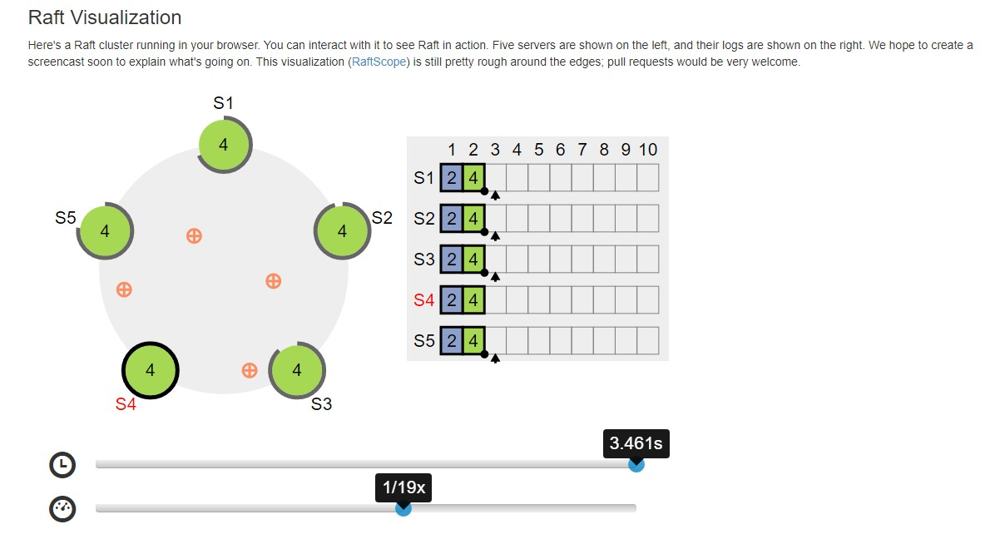
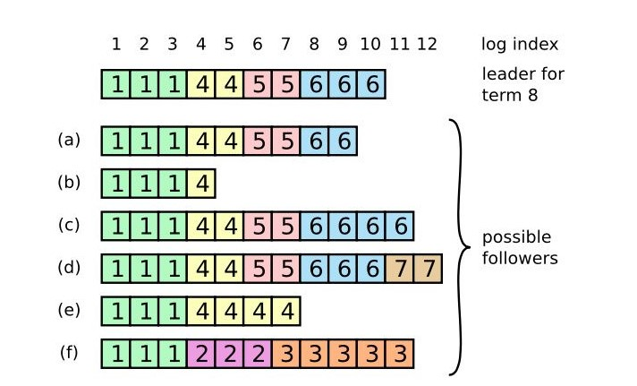
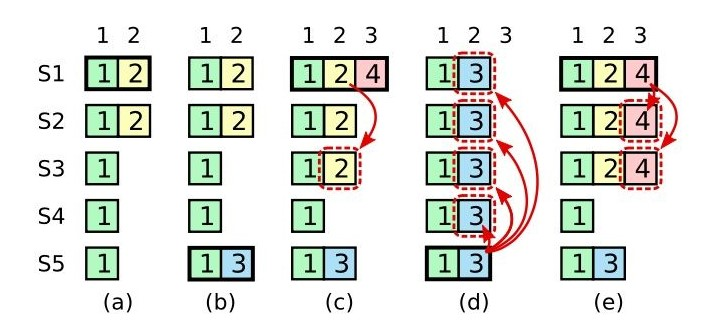
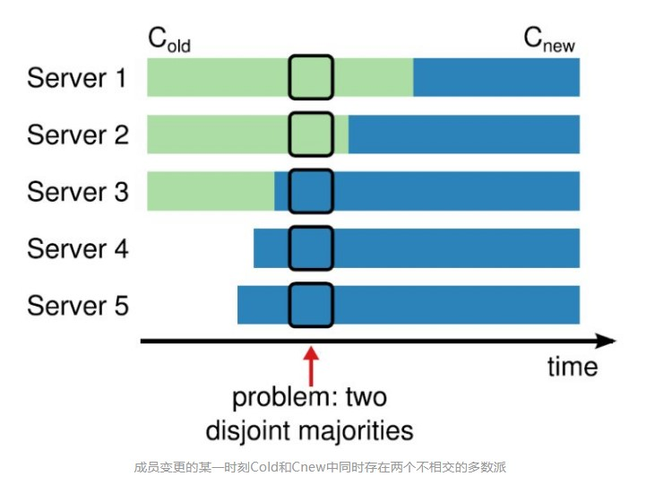
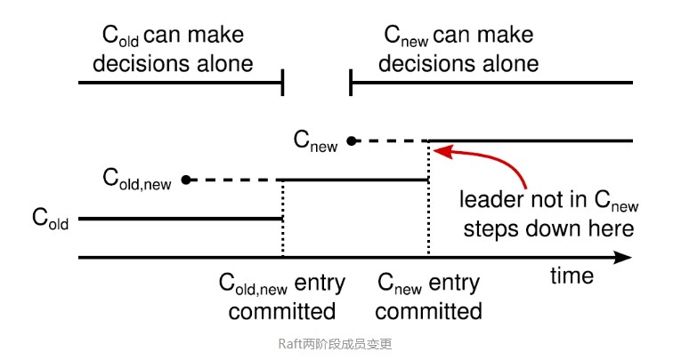

# 理解 Raft 算法

## Raft 算法概念

Raft 算法是由斯坦福大学提出的一种分布式协议，相比 Paxos 而言更加的容易理解。Raft 算法是从多副本状态机的角度出发，它用来用于管理多副本状态机的日志复制从而实现了和 Paxos 同样的功能。

之所以 Raft 算法相对 Paxos 算法更加容易理解，原因是 Raft 算法不允许类似 Paxos 中的乱序提交，并且将复杂的分布式一致性问题拆解为几个子问题：

* Leader 选举（Leader election）
* 日志复制（Log replicaiton）
* 安全性（Safety）
* 日志压缩（Log compaction）
* 成员变更（Membership change）

此外，相比 Paxos 直接从一致性协议推导，**Raft 算法则使用了更强的假设来减少需要考虑的状态，从而使其变得更加容易理解和实现。**


实际上，如果你不理解 Paxos 算法也不需要气馁，因为强如斯坦福大学和加州大学伯克利分校的高年级本科生和研究生在学习 Paxos 算法时也觉得难以理解；因此，学习这类复杂的东东需要一步一个脚印，不可能一下子就吃透！


## 一致性算法特性

* **安全性保证**（绝对不会返回一个错误的结果）：在非拜占庭错误情况下，包括网络延迟、分区、丢包、冗余和乱序等错误都可以保证正确。
* **可用性**：集群中只要有大多数的机器可运行并且能够相互通信、和客户端通信，就可以保证可用。因此，一个典型的包含 5 个节点的集群可以容忍两个节点的失败。服务器被停止就认为是失败。他们当有稳定的存储的时候可以从状态中恢复回来并重新加入集群。
* **不依赖时序来保证一致性**：物理时钟错误或者极端的消息延迟只有在最坏情况下才会导致可用性问题。
* 通常情况下，一条指令可以尽可能快的在集群中大多数节点响应一轮远程过程调用时完成。小部分比较慢的节点不会影响系统整体的性能。

## Raft 角色

Raft 算法将系统中的角色分为几个部分（_注：图片来自互联网_）：

* **Leader**：接收客户端请求并向 Follower 同步请求日志，当日志到大大多数节点后告诉 Follower 提交日志
* **Follower**：接受并持久化 Leader 同步的日志，在 Leader 告知日志可以提交后提交日志
* **Candiadte**：Leader 选举过程中的临时角色

## Message 的三种类型

| 类型 | 描述 |
| :--- | :--- |
| **RequestVote RPC** | 由 Candidate 发出，用于发送投票请求 |
| **AppendEntries RPC** | 由 Leader 发出，用于 Leader 向 Follower 复制日志条目，也会用作 Heartbeat（日志条目为空即为 Heartbeat） |
| **InstallSnapshot RPC** | 由 Leader 发出，用于快照传输 |

## Raft 选举


任期 term


首先弄清楚在 Raft 算法中任期（term）的概念：

* 时间被划分为一个一个的任期（任期用连续的整数标记），在每一个任期开始都是一次选举，每次选举成功后在任期内会产生**最多一个 Leader** 直到任期结束；
* 如果选举失败，这个任期内就会因为没有 Leader 产生而结束；
* 此外，任期之间的切换可以在不同的时间、不同服务器上观察到。


选举 Leader


**Raft 采用了一种心跳机制来触发 Leader 选举！**

Raft 要求系统在任意时刻最多只能有一个 Leader，正常工作期间只能有 Leader、Followers 这两个角色，关于 Raft 算法系统中的角色的状态描述即流程图如下（_注：图片来自互联网_）：

* 开始，所有服务启动都是 Follower，在 Follower 超时没有收到 Leader 心跳之后，**Follower 超时**（没有收到任何来自 Leader 的心跳），**此时它会成为一个 Candidate 并开始一次 Leader 选举**
* 在 election 期间各个 Candidate 开始投票 election Leader
  * 如果在 Candidate 期间发现一个 Leader 或开启了一个新的 term，它就会从 Candidate 变为 Follower
* 此时收到大多数服务器投票的 Candidate 会成为新的 Leader
  * 如果经由投票产生的 Leader 发现在更早的 term 已经产生了一个 Leader 则此时它会转变为 Follower

> 如果你需要动态的查看选举这样的流程，可以参考文末的链接 [The Raft Consensus Algorithm](https://raft.github.io/)，它提供了一个选举的动画可以帮助你理解、消化 Raft 的选举流程（_注：图片来自互联网_）。


此外，需要特别指出的几点：


* Raft 是通过心跳（heartbeat）来触发选举流程的；Leader 周期性的向 Follower 发送心跳从而维持其 Leader 地位
* Follower 不会主动提出请求，只是响应 Leader 和 Candidate 的请求
* Leader 负责处理所有客户端请求（假如某个客户端先连接到 Follower，那么 Follower 要负责把这个客户端重定向到 Leader）

## 日志结构

日志的数据结构总总体上可以分为：**term**（任期号）、**command**（状态机需要执行的指令内容）、**index**（索引，日志条目在日志中的位置），日至结构图如下：

如上图所示，总共有 12 条日志条目，其中：

* Follower 和 Leader 的日志可能存在不同步
* **Leader 强制 Follower 复制它的日志来处理日志的不一致，Follower 上的不一致的日志会被 Leader 的日志覆盖**
  * Leader为了使Followers的日志同自己的一致，Leader需要找到Followers同它的日志一致的地方，然后覆盖Followers在该位置之后的条目）
  * Leader 会从后往前试，每次 AppednEntries 失败后尝试前一个日志条目，直到成功找到每个 Follower 的日志的一致位的 index，然后逐条覆盖 Follower 在该 index 之后的日志条目

## 日志复制

> Raft 的日志由日志有序编号（log index）组成，每个日志条目（log entries）包含了它被创建时的任期号（term）

在选举出 Leader 之后，Leader 就可以开始接收客户端的请求。Leader 把请求作为日志条目（Log entries）加入到它的日志中，然后并行的向其他服务器发起 AppendEntries RPC 复制这些日志条目。当这些日志被复制到大多数服务器上，Leader 将这条日志应用到它的状态机并向客户端返回执行结果！

\*\*\*\*🌠 **如果某些 Follower 可能没有成功的复制日志（比如 Follower 宕机了），Leader 会无限的重试直到所有 Follower 最终存储了所有日志条目**（_注：图片来自互联网_）

Raft 维护着以下日志机制从而维护一个不同服务器的日志之间的高层次的一致性：

* 如果在不同的日志中的两个条目拥有相同的索引和任期号，那么他们存储了相同的指令
* 如果在不同的日志中的两个条目拥有相同的索引和任期号，那么他们之前的所有日志条目也全部相同

## 安全性


Raft 安全性限制：

* **选举限制：**Raft 使用投票的方式来阻止一个候选人赢得选举除非这个候选人包含了所有已经提交的日志条目；RequestVote RPC 中包含了 Follower 的日志信息（Follower的最后日志条目 index、Follower 最后日志条目的 term），然后投票人会拒绝掉那些日志条目没有自己新的投票请求；即：**拥有最新的已提交的log entry的Follower才有资格成为Leader**
* **提交之前任期内的日志条目：**简单的说就是新的 Leader 并不知道之前的老日志条目是否是已提交的状态


我们来探讨即使满足 **选举限制** 这一条件依然不能保证一致性的情况，首先看下图（_注：图片来自互联网_）

* \(a\)  S1是Leader，并且部分地复制了 index-2；
* \(b\)  S1宕机，S5得到S3、S4、S5的投票当选为新的Leader（S2不会选择S5，因为S2的日志较S5新），并且在index-2写入到一个新的条目，此时是term=3（注：之所以是term=3，是因为在term-2的选举中，S3、S4、S5至少有一个参与投票，也就是至少有一个知道term-2，虽然他们没有term-2的日志）；
* \(c\)   S5宕机，S1恢复并被选举为Leader，并且开始继续复制日志（也就是将来自term-2的index-2复制给了S3），此时term-2，index-2已经复制给了多数的服务器，但是还没有提交；
* \(d\)  S1再次宕机，并且S5恢复又被选举为Leader（通过S2、S3、S4投票，因为S2、S3、S4的term=4&lt;5，且日志条目\(为term=2,index=2\)并没有S5的日志条目新，所以可以选举成功），然后覆盖Follower中的index-2为来自term-3的index-2；（注：此时出现了，term-2中的index-2已经复制到三台服务器，还是被覆盖掉）；
* \(e\)  然而，如果S1在宕机之前已经将其当前任期（term-4）的条目都复制出去，然后该条目被提交（那么S5将不能赢得选举，因为S1、S2、S3的日志term=4比S5都新）。此时所有在前的条目都会被很好地提交。

如果上述情况 \(c\) 中，term=2, index=2 的日志条目被复制到大多数后，如果此时当选的 S1 提交了该日志条目，则后续产生的 term=3,index=2 会覆盖它，此时就可能会在同一个 index 位置先后提交一个不同的日志，这就违反了状态机安全性，产生不一致。也就是说当一个新 Leader 当选时，由于所有成员的日志进度不同，很可能需要继续复制前面 term 的日志条目，就算复制到多数服务器并且提交，还是可能被覆盖，因为前面 term 对应的日志条目较旧，容易使的没有这些条目的其他服务器当选 Leader，此时就会覆盖这些日志条目。

**为了消除上述场景就规定 Leader 可以复制前面任期的日志，但是不会主动提交前面任期的日志。而是通过提交当前任期的日志，而间接地提交前面任期的日志**

## 日志压缩


Raft 采用对整个系统进行 snapshot 来解决日志压缩，snapshot 之前的日志都可以丢弃！


* 每个副本独立的对自己的系统状态进行 snapshot，并且只能对已提交的记录进行 snapshot
* snapshot 中包含两类数据
  * 日志元数据：最后一条已提交的日志条目的 index、iterm（这两个值在snapshot之后的第一条log entry的AppendEntries RPC的完整性检查的时候会被用上）
  * 系统当前状态
* 当 Leader 发送给一个日志落后太多的 Follower 的日志条目会被丢弃，Leader 会发送 snapshot 给 Follower；或者新加入一台机器时，也会发送 snapshot 给它
* snapshot 不能太频繁，否者影响磁盘带宽；也不能做的不频繁，否者一旦某个节点重启需要回放大量的日志条目，影响可用性（推荐做法时日志量达到一定大小后就做一次 snapshot）
* snapshot 一次的耗时可能会比较长，会影响正常的日志同步；可以通过 copy-on-write 技术避免 snapshot 过程影响正常日志同步

## 成员变更

成员变更是指在集群运行过程中副本发生变化，因为在各个服务器提交成员变更的时刻可能不同，造成各个服务器从旧成员配置（Cold）切换到新成员配置（Cnew）的时刻不同，所以在这个过程中可能会出现在成员变更的某个时刻，因为 Cold、Cnew 中同时存在两个不相交的多数派，这样的话可能会造成产生多个 Leader，进而行程了不同的决议，破坏了安全性，如下图（_注：图片来自互联网_）：

为了解决上面的问题，Raft 提出了两阶段的成员变更方法！两阶段成员变更过程如下（_注：图片来自互联网_）：

1. Leader 收到成员变更请求从 Cold 切成 Cnew；
2. Leader 在本地生成一个新的 log entry，其内容是 Cold∪Cnew，代表当前时刻新旧成员配置共存，写入本地日志，同时将该 log entry 复制至 Cold∪Cnew 中的所有副本。在此之后新的日志同步需要保证得到 Cold 和 Cnew 两个多数派的确认；
3. Follower 收到 Cold∪Cnew 的 log entry 后更新本地日志，并且此时就以该配置作为自己的成员配置；
4. 如果 Cold 和 Cnew 中的两个多数派确认了 Cold U Cnew 这条日志，Leader 就提交这条 log entry；
5. 接下来 Leader 生成一条新的 log entry，其内容是新成员配置 Cnew，同样将该 log entry 写入本地日志，同时复制到 Follower 上；
6. Follower 收到新成员配置 Cnew 后，将其写入日志，并且从此刻起，就以该配置作为自己的成员配置，并且如果发现自己不在 Cnew 这个成员配置中会自动退出；
7. Leader 收到 Cnew 的多数派确认后，表示成员变更成功，后续的日志只要得到 Cnew 多数派确认即可。Leader 给客户端回复成员变更执行成功。


异常分析


* 如果 Leader的 Cold U Cnew 尚未推送到 Follower，Leader 就挂了，此后选出的新 Leader 并不包含这条日志，此时新 Leader 依然使用 Cold 作为自己的成员配置。
* 如果 Leader的 Cold U Cnew 推送到大部分的 Follower 后就挂了，此后选出的新 Leader 可能是 Cold 也可能是 Cnew 中的某个 Follower。
* 如果 Leader 在推送 Cnew 配置的过程中挂了，那么同样，新选出来的 Leader 可能是 Cold 也可能是 Cnew 中的某一个，此后客户端继续执行一次改变配置的命令即可。
* 如果大多数的 Follower 确认了 Cnew 这个消息后，那么接下来即使 Leader 挂了，新选出来的 Leader 肯定位于 Cnew 中。

两阶段成员变更比较通用且容易理解，但是实现比较复杂，同时两阶段的变更协议也会在一定程度上影响变更过程中的服务可用性，因此我们期望增强成员变更的限制，以简化操作流程。

两阶段成员变更，之所以分为两个阶段，是因为对Cold与Cnew的关系没有做任何假设，为了避免 Cold 和 Cnew 各自形成不相交的多数派选出两个 Leader，才引入了两阶段方案。

如果增强成员变更的限制，假设 Cold 与 Cnew 任意的多数派交集不为空，这两个成员配置就无法各自形成多数派，那么成员变更方案就可能简化为一阶段。

那么如何限制 Cold 与 Cnew，使之任意的多数派交集不为空呢？方法就是每次成员变更只允许增加或删除一个成员。

可从数学上严格证明，只要每次只允许增加或删除一个成员，Cold 与 Cnew不 可能形成两个不相交的多数派。


一阶段成员变更


* 成员变更限制每次只能增加或删除一个成员（如果要变更多个成员，连续变更多次）。
* 成员变更由 Leader 发起，Cnew 得到多数派确认后，返回客户端成员变更成功。
* 一次成员变更成功前不允许开始下一次成员变更，因此新任 Leader 在开始提供服务前要将自己本地保存的最新成员配置重新投票形成多数派确认。
* Leader 只要开始同步新成员配置，即可开始使用新的成员配置进行日志同步。

## 浓缩总结

> Raft 一致性算法浓缩总结，不包含成员变更、日志压缩

| **特性** | **解释** |
| :--- | :--- |
| 选举安全特性 | 对于一个给定的任期号，最多只会有一个领导人被选举出来（5.2 节） |
| 领导人只附加原则 | 领导人绝对不会删除或者覆盖自己的日志，只会增加（5.3 节） |
| 日志匹配原则 | 如果两个日志在相同的索引位置的日志条目的任期号相同，那么我们就认为这个日志从头到这个索引位置之间全部完全相同（5.3 节） |
| 领导人完全特性 | 如果某个日志条目在某个任期号中已经被提交，那么这个条目必然出现在更大任期号的所有领导人中（5.4 节） |
| 状态机安全特性 | 如果一个领导人已经将给定的索引值位置的日志条目应用到状态机中，那么其他任何的服务器在这个索引位置不会应用一个不同的日志（5.4.3 节） |

## Reference

* [The Raft Consensus Algorithm](https://raft.github.io/)
* [Raft 算法中文版](https://github.com/maemual/raft-zh_cn/blob/master/raft-zh_cn.md)
* [Raft Paper](https://raft.github.io/raft.pdf)
* [Raft 算法详解](https://zhuanlan.zhihu.com/p/32052223)
* [Raft 算法安全性保证](https://www.cnblogs.com/gaorong/p/7274681.html)

