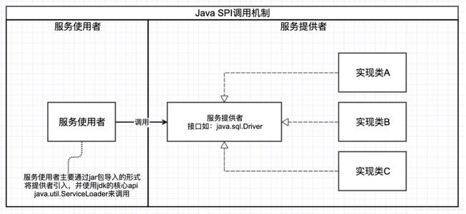
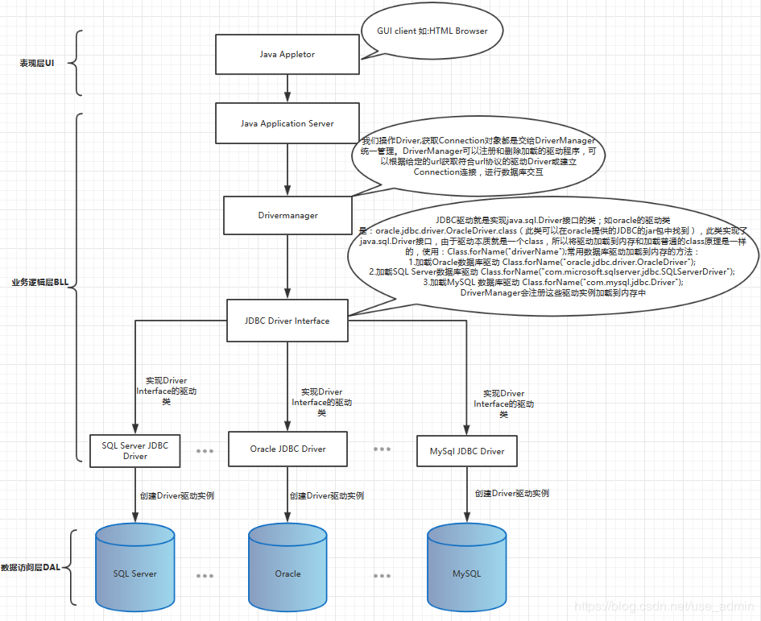
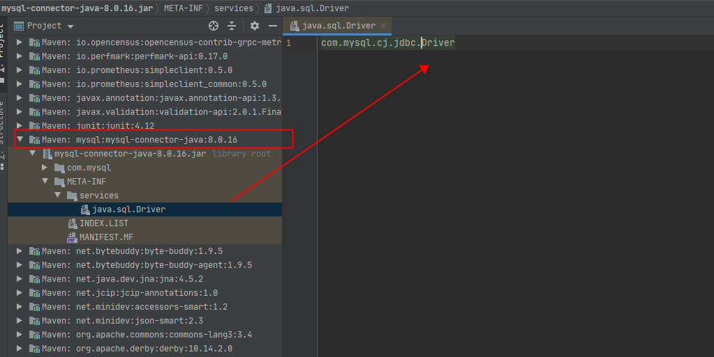
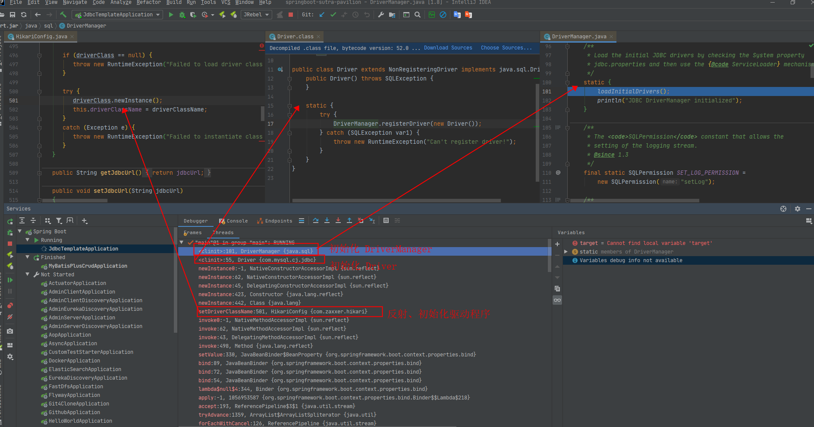

# **SPI 机制**

`SPI`，即 `Service Provider Interface`，是 `Java` 提供的一套用于被第三方实现或者扩展的 `API`，他可以用来启用框架扩展和替换组件，整体机制如下图：

> 图片来源于网络



实际上就是 `基于接口的编程 + 策略模式 + 配置文件` 组合实现的动态加载机制。也就是说在我们的模块装配的时候能不再程序里动态指明，这就需要一种服务发现机制，而 `Java SPI` 就提供了这样的一套机制：

```text
为某个接口寻找服务实现的机制：将装配的控制权移交到程序之外，实现解耦
```

**SPI使用场景：**

- JDBC 驱动自动加载
- SLF4J 加载不同提供商的日志实现类

此外就是在诸如 `Spring`、`Dubbo` 中使用了很多的 `SPI` 来实现扩展。

看到这里还是有点懵？没关系，下面我们通过一个几乎你们天都在接触的东东来说明下 `SPI` 机制

</br>

## **JDBC驱动加载中的SPI机制**

看到这个标题有没有一种恍然大悟的感觉，我猜测你或多或少都了解过一些关于数据库驱动的知识，尤其是以前学习 JDBC 时一定看过关于 Java 提供了一个 Driver 接口，其他数据库厂商各自去进行这个接口的实现这样的描述。我们先来看下 JDBC 驱动结构模型：

> 图片来自 [JDBC数据库驱动及原理](https://blog.csdn.net/use_admin/article/details/89416172?utm_medium=distribute.pc_relevant_t0.none-task-blog-BlogCommendFromMachineLearnPai2-1.nonecase&depth_1-utm_source=distribute.pc_relevant_t0.none-task-blog-BlogCommendFromMachineLearnPai2-1.nonecase)



**回顾：JDBC连接数据库**

我们知道，加载 JDBC 驱动程序一般是通过 `Class.forName(“xxx”)` 这样的形式，我们先回顾一下使用 JDBC 连接数据库的代码：

```java
  	//1.加载mysql数据库驱动
  	static String driverName = "com.mysql.jdbc.Driver";
  	//2.加载oracle数据库驱动
  	//static String driverName = "oracle.jdbc.driver.OracleDriver";
  	//3.加载SQL Server数据库驱动
  	//static String driverName = "com.microsoft.sqlserver.jdbc.SQLServerDriver";

        static String url = "jdbc:mysql://127.0.0.1:3306/mysql";
        static String username = "root";
        static String password = "123456";
        
        // 获取数据库连接
        public void getConnection() {
            try {
                // 1.1 加载驱动,使用Class.forName()将驱动类加载到内存
                Class.forName(driverName);
                //1.2 或者使用
                //Driver driver = (Driver) Class.forName(driverName).newInstance();

                // 2.1 获取connection
                Connection conn = DriverManager.getConnection(url,username,password);

                // 2.2 或者使用
下面方式获取 connection
               /* 
                 Properties info = new Properties();
                 info.put("user", username);
                 info.put("password", password);
                 Connection conn = driver.connect(url, info);
                */
                System.out.println(conn);
            } catch (ClassNotFoundException e) {
                e.printStackTrace();
            } catch (SQLException e) {
                e.printStackTrace();
            }
    
        }
```

从上面的 JDBC 连接数据库中的 `Class.forName(driverName);
` 中我们能够知道这个方法实际上是将类进行初始化并加载到 JVM 中（敲黑板：这里涉及了类加载机制的知识点），那么这里和 JDBC 驱动加载貌似没有半毛钱关系啊？带着这个疑问，继续往下看。

</br>

## **JDBC驱动加载原理**

我们来看下通过 `Class.forName()` 加载类中传入的参数 `driverName` 所指向的代码（以 MySQL 为例）：

```java
package com.mysql.cj.jdbc;

import java.sql.DriverManager;
import java.sql.SQLException;

public class Driver extends NonRegisteringDriver implements java.sql.Driver {
    public Driver() throws SQLException {
    }
    
    // 静态代码块，在类加载时会执行代码块中的内容，实际上就是去注册驱动
    static {
        try {
            DriverManager.registerDriver(new Driver());
        } catch (SQLException var1) {
            throw new RuntimeException("Can't register driver!");
        }
    }
}
```

可以通过上面的代码看到当我们通过 `Class.forName()` 去加载类时会触发相应驱动类的 `static` 代码块，**也就是说使用 `Class.forName()` 实际是将当前驱动类注册到 DriverManager 中，而 DriverManager  第一次被调用时会触发 DriverManager 的静态代码块，继而调用 `loadInitialDrivers()` 方法完成响应的初始化，这就解释了前面我们对于通过 Class.forName() 没有看到任何类加载、初始化的疑惑**，如下：

```java
// 一：MySQL 驱动实现类中的静态代码块
public class Driver extends NonRegisteringDriver implements java.sql.Driver {
    public Driver() throws SQLException {
    }

    static {
        try {
            // 注册驱动
            DriverManager.registerDriver(new Driver());
        } catch (SQLException var1) {
            throw new RuntimeException("Can't register driver!");
        }
    }
}

// 二：DriverManager 类中的静态代码块
/**
 * 通过检查系统属性 jdbc.properties来加载初始的JDBC驱动程序，然后使用{@code ServiceLoader}机制进行初始化
 */
static {
    loadInitialDrivers();
    println("JDBC DriverManager initialized");
}
```

可以看到使用 `Class.forName()` 实际上就是等于调用了 `loadInitialDrivers();` 来初始化驱动，我们在看这个初始化驱动的方法就可以看到方法内提供了两种加载驱动类的方式：

- 方式一是直接通过读取系统变量的方式
- 方式二是通过 `ServiceLoader` 加载的方式

</br>

**JDBC驱动加载方式一、方式二剖析**

> DriverManager 初始化驱动

```java
private static void loadInitialDrivers() {
    // 方式一：通过读取系统变量加载驱动
    String drivers;
    try {
        // 获取系统变量为 jdbc.drivers的驱动名称
        drivers = AccessController.doPrivileged(new PrivilegedAction<String>() {
            public String run() {
                return System.getProperty("jdbc.drivers");
            }
        });
    } catch (Exception ex) {
        drivers = null;
    }

    // 方式二：通过 ServiceLoader 加载驱动（需要重点关注）
    AccessController.doPrivileged(new PrivilegedAction<Void>() {
        public Void run() {
            // 返回一个 ServiceLoader 对象
            ServiceLoader<Driver> loadedDrivers = ServiceLoader.load(Driver.class);
            // 获取惰性迭代器
            Iterator<Driver> driversIterator = loadedDrivers.iterator();
            // 加载这些驱动程序，以便可以实例化它们。
            try{
                while(driversIterator.hasNext()) {
                    // 核心：惰性迭代器触发惰性迭代器中的 hasNextService 方法
                    driversIterator.next();
                }
            } catch(Throwable t) {
            // Do nothing
            }
            return null;
        }
    });

    println("DriverManager.initialize: jdbc.drivers = " + drivers);

    if (drivers == null || drivers.equals("")) {
        return;
    }
    String[] driversList = drivers.split(":");
    println("number of Drivers:" + driversList.length);
    for (String aDriver : driversList) {
        try {
            println("DriverManager.Initialize: loading " + aDriver);
            // 最终还是通过 系统类加载器加载 DriverClass 并初始化
            Class.forName(aDriver, true,
                    ClassLoader.getSystemClassLoader());
        } catch (Exception ex) {
            println("DriverManager.Initialize: load failed: " + ex);
        }
    }
}
```

第一种加载驱动的方式很好理解，是从系统环境变量中获取 `jdbc.drivers` 指向的类路径，后续就是根据这个类路径通过 ClassLoader 去初始化加载驱动了；下面我们着重于分析下第二种加载驱动的方式，即通过 ServiceLoader 加载驱动的的过程是怎样的。

</br>

**ServiceLoader讲解**

我们一步一步看源码可以发现，通过上面的 `ServiceLoader.load(Driver.class);` 方法实际上并没有立即去加载驱动，而是返回了 `ServiceLoader<>(service, loader);`，对应 ServiceLoader 构造器代码如下：

```java
    // 构造器
    private ServiceLoader(Class<S> svc, ClassLoader cl) {
        // 检查驱动类 service
        service = Objects.requireNonNull(svc, "Service interface cannot be null");
        // 取得一个 classLoader
        loader = (cl == null) ? ClassLoader.getSystemClassLoader() : cl;
        // 取得 AccessController 的上下文
        acc = (System.getSecurityManager() != null) ? AccessController.getContext() : null;
        reload();
    }
    
    // 返回一个 当前的惰性查找迭代器
    public void reload() {
        providers.clear();
        lookupIterator = new LazyIterator(service, loader);
    }
```

通过 ServiceLoader 方式方式加载驱动最后获得了一个惰性迭代器，然后调用 `hasNext()` 方法，最终会调用到惰性迭代器 `LazyIterator` 的 `hasNextService()` 方法，然后再通过 ClassLoader 将类装载到 JVM 中完成驱动的初始化、加载！

</br>

需要值得注意的是：__在 ServiceLoader 中有一个静态变量  PREFIX，这个变量指向的就是 `META-INF/services/`，在 hasNextService() 方法中会加上这个 PREFIX 拼接出类路径地址然后由 Classloader 加载指定的驱动！__，具体代码如下：

```java
    // 前缀地址
    private static final String PREFIX = "META-INF/services/";
    
    // 惰性迭代器 hasNextService 方法
    private boolean hasNextService() {
        if (nextName != null) {
            return true;
        }
        if (configs == null) {
            try {
                // 读取驱动的全路径
                String fullName = PREFIX + service.getName();
                // 装载驱动
                if (loader == null)
                    configs = ClassLoader.getSystemResources(fullName);
                else
                    configs = loader.getResources(fullName);
            } catch (IOException x) {
                fail(service, "Error locating configuration files", x);
            }
        }
        while ((pending == null) || !pending.hasNext()) {
            if (!configs.hasMoreElements()) {
                return false;
            }
            pending = parse(service, configs.nextElement());
        }
        nextName = pending.next();
        return true;
    }

    // 从用于加载类的搜索路径中查找指定名称的所有资源
    public static Enumeration<URL> getSystemResources(String name)
        throws IOException
    {
        ClassLoader system = getSystemClassLoader();
        if (system == null) {
            return getBootstrapResources(name);
        }
        return system.getResources(name);
    }
```

</br>

**DriverManager管理Driver、Connection**

此外，DriverManager 还提供了 Driver 管理、Connection 对象管理的方法。通过 DriverManager 获取 Connection 的方法我想大家不会面生，那么获取 Connection 的背后是什么呢，如下：

```java
    // 通过 DriverManager 获取 Connection 对象
    Connection conn =  DriverManager.getConnection(URL, USER, PASSWORD);

    // getConnection 方法最后调用的源码如下：
    private static Connection getConnection(
        String url, java.util.Properties info, Class<?> caller) throws SQLException {
        // 可以看到，caller 实际上就是类加载器，和我们前面说的是吻合的
        ClassLoader callerCL = caller != null ? caller.getClassLoader() : null;
        synchronized(DriverManager.class) {
            // synchronize loading of the correct classloader.
            if (callerCL == null) {
                callerCL = Thread.currentThread().getContextClassLoader();
            }
        }
    
        if(url == null) {
            throw new SQLException("The url cannot be null", "08001");
        }
    
        println("DriverManager.getConnection(\"" + url + "\")");
    
        // 遍历并尝试建立连接的已加载的 registeredDriver
        // 记住第一个引发的异常，我们可以重新引发它。
        SQLException reason = null;
    
        for(DriverInfo aDriver : registeredDrivers) {
            // 判断是否有权限建立连接，无权限则跳过
            if(isDriverAllowed(aDriver.driver, callerCL)) {
                try {
                    println("    trying " + aDriver.driver.getClass().getName());
                    // 建立连接，这就看具体 Driver 的实现是什么了
                    Connection con = aDriver.driver.connect(url, info);
                    if (con != null) {
                        // Success!
                        println("getConnection returning " + aDriver.driver.getClass().getName());
                        return (con);
                    }
                } catch (SQLException ex) {
                    if (reason == null) {
                        reason = ex;
                    }
                }
    
            } else {
                println("    skipping: " + aDriver.getClass().getName());
            }
    
        }
    
        // 如果连接存在异常，则抛出异常原因
        if (reason != null)    {
            println("getConnection failed: " + reason);
            throw reason;
        }
    
        println("getConnection: no suitable driver found for "+ url);
        throw new SQLException("No suitable driver found for "+ url, "08001");
    }
```

</br>

## **JDBC驱动加载原理小结**

这里补充一下： **在JDBC 4.0之后实际上我们不需要再调用Class.forName来加载驱动程序了**，因此我们可以在自己选择的第三方数据库厂商提供的 connector jar 包下的 `META-INF/services` 目录下可以看到一个 `java.sql.Driver` 的文件，如下：



</br>

在我们集成第三方数据源时，程序启动后，经过一系列初始化后会 `加载数据源配置`（我使用的是 `HikariCP` 数据源），此时会在 `HikariConfig` 中的 `setDriverClassName()` 方法中有这样一行实例化驱动的代码：

```java
    try {
       // 实例化驱动
       driverClass.newInstance();
       this.driverClassName = driverClassName;
    }
    catch (Exception e) {
       throw new RuntimeException("Failed to instantiate class " + driverClassName, e);
    }
```

这个实例化方法经过反射调用到了我们集成的 JDBC 驱动，从而引发了 `DriverManager` 的静态代码执行，完成后续初始化（也就是前面讲的剖析的 JDBC 的加载原理了）。我们借助 IDE 启动时可以在 DriverManager 的 `loadInitialDrivers();` 方法上打上断点然后 Debug，然后分析 Threads 信息如下：



</br>

这样，我们知道了 __驱动在什么时候会被自动加载__，而这种自动加载驱动的技术方案就叫 `SPI`

</br>

## **Reference**

- [Oracle DriverManager](https://docs.oracle.com/javase/6/docs/api/java/sql/DriverManager.html)

</br></br>