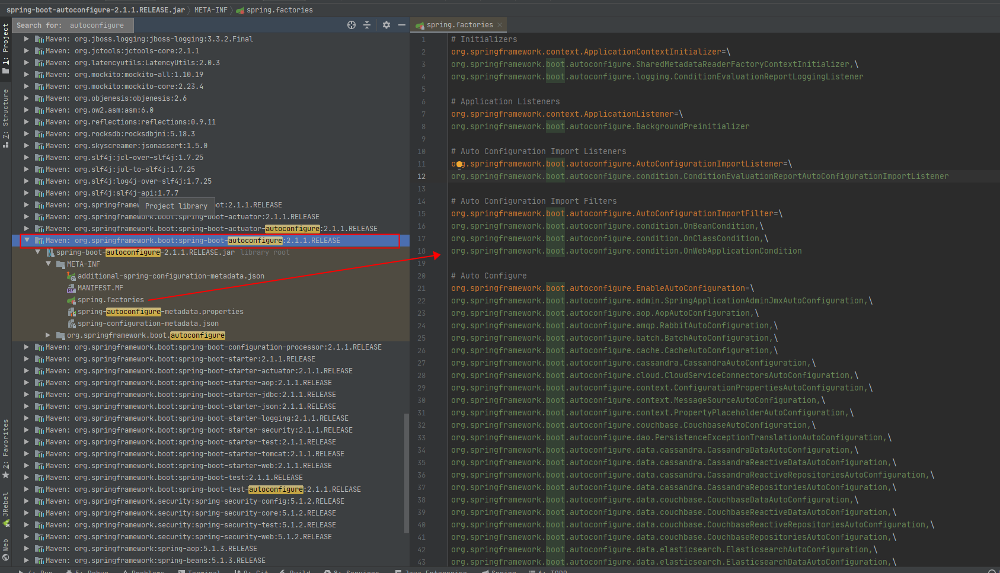

# **简介**

说道 `SpringBoot` 中的 `spring.factories`，就不得不提 `SPI` 机制，可以参考笔者的另一篇文章（SPI与JDBC驱动加载原理）了解 `SPI` 的概念，作用，这里就不再复述了。

在 `Spring` 中也有一种类似与 `Java SPI` 的加载机制。它在 `META-INF/spring.factories` 文件中配置接口的实现类名称，然后在程序中读取这些配置文件并实例化。这种自定义的 `SPI` 机制是 `Spring Boot Starter` 实现的基础吗，如下：

## **SpringBoot **

